**Цель работы:** Познакомиться с простейшими запросами; научиться выводить поля из одной таблицы и из различных таблиц с использованием оператора SELECT.

## 1. Настройка среды разработки (Docker Compose)

Для выполнения лабораторной работы используется изолированная среда на основе Docker. База данных запускается через отдельный файл `docker-compose.yml` внутри папки `lab-02`, что позволяет не смешивать данные разных лабораторных работ.

```yaml
services:
  db:
    image: mysql:8.0
    container_name: mysql-lab02
    restart: always
    command:
      [
        "mysqld",
        "--character-set-server=utf8mb4",
        "--collation-server=utf8mb4_unicode_ci",
      ]
    environment:
      MYSQL_ROOT_PASSWORD: secret
      MYSQL_DATABASE: lab
    ports:
      - "3308:3306"
    volumes:
      - lab02-data:/var/lib/mysql
      - ./init.sql:/docker-entrypoint-initdb.d/init.sql
    networks:
      - shared

volumes:
  lab02-data:

networks:
  shared:
    external: true
    name: mysql-shared
```

`image: mysql:8.0` — используется образ MySQL версии 8.0 для обеспечения совместимости с синтаксисом лабораторных заданий.

`ports: "3308:3306"` — каждая лабораторная использует свой порт на хосте во избежание конфликтов при одновременной работе нескольких лаб.

`volumes: ./init.sql:/docker-entrypoint-initdb.d/init.sql` — монтирует файл схемы напрямую. MySQL автоматически выполняет все `.sql` файлы из этой директории при первом запуске контейнера.

`networks: shared/external: mysql-shared` — база подключается к общей сети проекта, что позволяет Prisma Studio и phpMyAdmin видеть её без дополнительной настройки.

## 2. Теоретические сведения

Содержимое таблиц в MySQL просматривается с помощью оператора `SELECT`. Базовый синтаксис:

```sql
SELECT <поля> FROM <таблица>
```

Вместо списка полей можно указать символ `*`, означающий выбор всех столбцов. Для исключения повторяющихся записей используется ключевое слово `DISTINCT`. Для ограничения числа выводимых строк применяется команда `LIMIT номер_позиции, количество_строк`. Для переименования поля в результате выборки используется псевдоним `AS`.

## 3. База данных STUDENT

В данной и последующих лабораторных работах используется учебная база данных `student`, содержащая сведения о студентах, их родителях, преподавателях, дисциплинах и успеваемости. Схема базы данных включает следующие таблицы:

| Таблица     | Назначение                                     |
| ----------- | ---------------------------------------------- |
| dannie      | Основные сведения о студентах                  |
| region      | Регионы проживания студентов                   |
| gorod       | Города проживания студентов                    |
| ulica       | Улицы проживания студентов                     |
| gruppa      | Учебные группы                                 |
| spec        | Перечень специальностей                        |
| roditeli    | Сведения о родителях студентов                 |
| roddeti     | Связующая таблица родителей и студентов        |
| prepod      | Сведения о преподавателях                      |
| dischiplina | Изучаемые дисциплины                           |
| uspev       | Оценки, выставленные преподавателями студентам |

## 4. Выполнение заданий

### Задание 1. Вывести данные из таблицы DANNIE

Оператор `SELECT *` выбирает все столбцы указанной таблицы без фильтрации.

```sql
SELECT * FROM dannie;
```

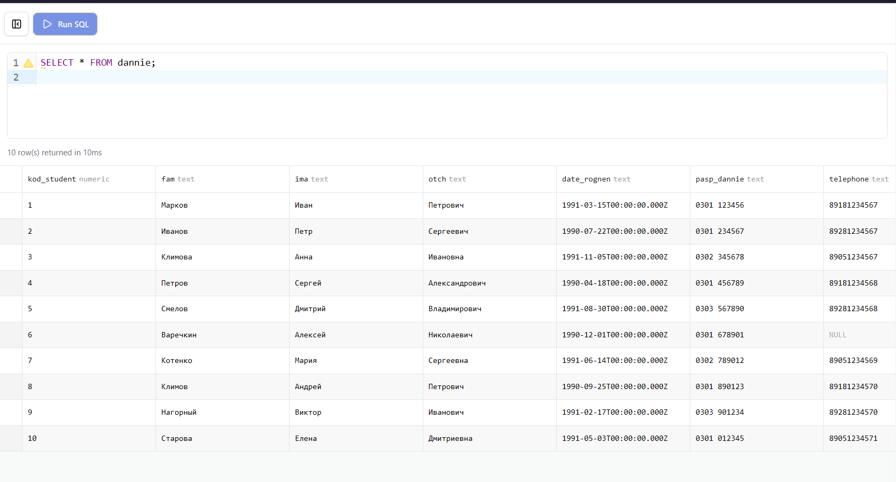

### Задание 2. Вывести данные из таблицы DISCHIPLINA

```sql
SELECT * FROM dischiplina;
```

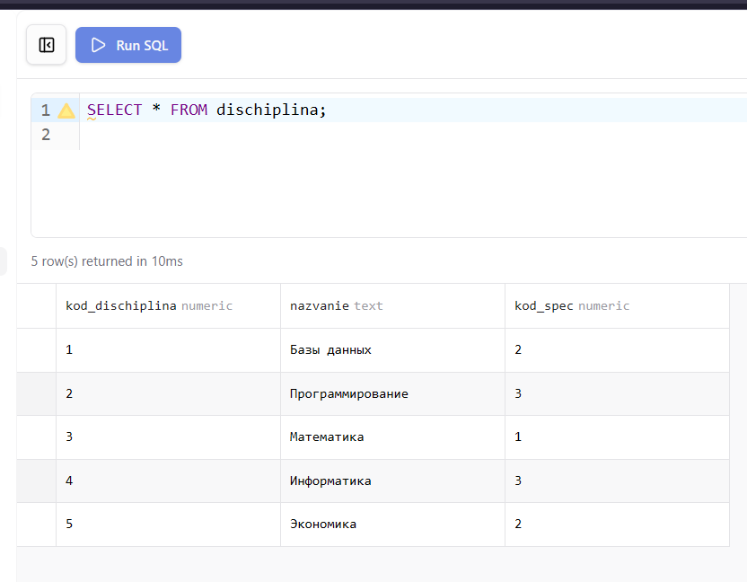


### Задание 3. Вывести фамилии всех студентов

При выборке одного поля указывается только его имя. Результат содержит столбец `fam` со всеми записями таблицы.

```sql
SELECT fam FROM dannie;
```

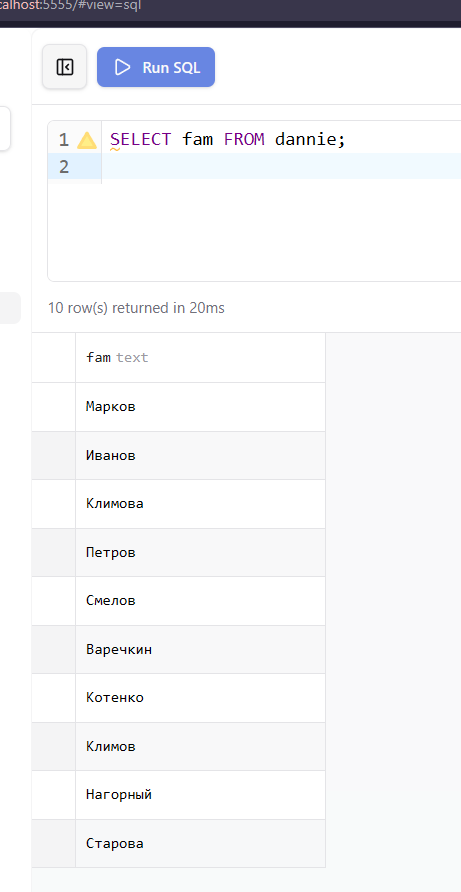

### Задание 4. Вывести названия всех групп

```sql
SELECT nazvanie FROM gruppa;
```

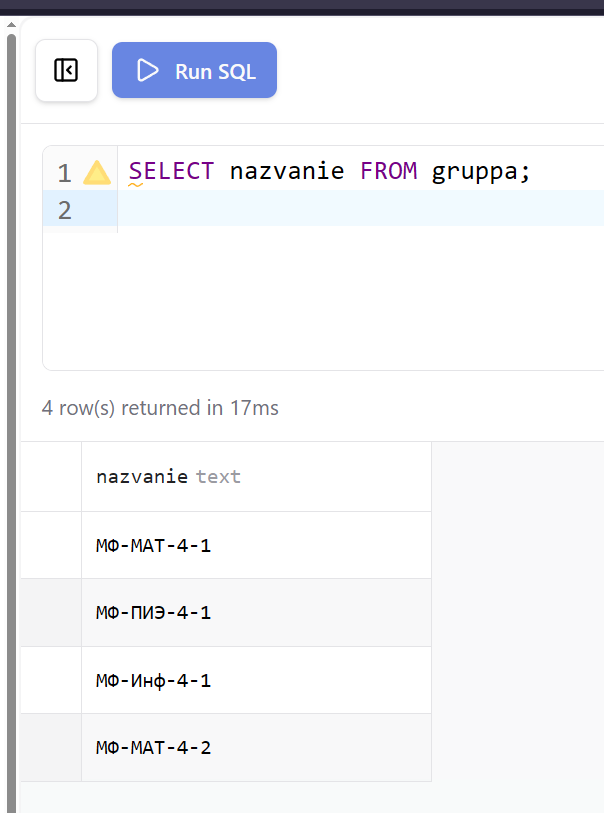

### Задание 5. Вывести фамилии, имена, телефоны и паспортные данные студентов

Для выборки нескольких полей их имена перечисляются через запятую.

```sql
SELECT fam, ima, telephone, pasp_dannie FROM dannie;
```

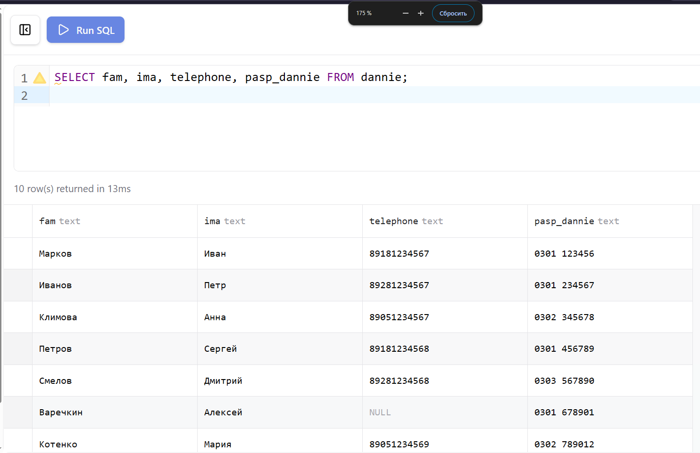

### Задание 6. Вывести фамилии родителей и телефоны

```sql
SELECT fio_rod, tel FROM roditeli;
```

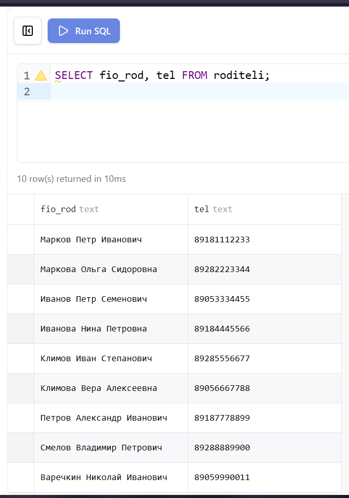

### Задание 7. Вывести названия городов и названия улиц

Для вывода полей из разных таблиц используются составные имена в формате `имя_таблицы.имя_поля`. Без объединения таблицы образуют декартово произведение — все возможные комбинации строк.

```sql
SELECT gorod.nazvanie, ulica.nazvanie FROM gorod, ulica;
```

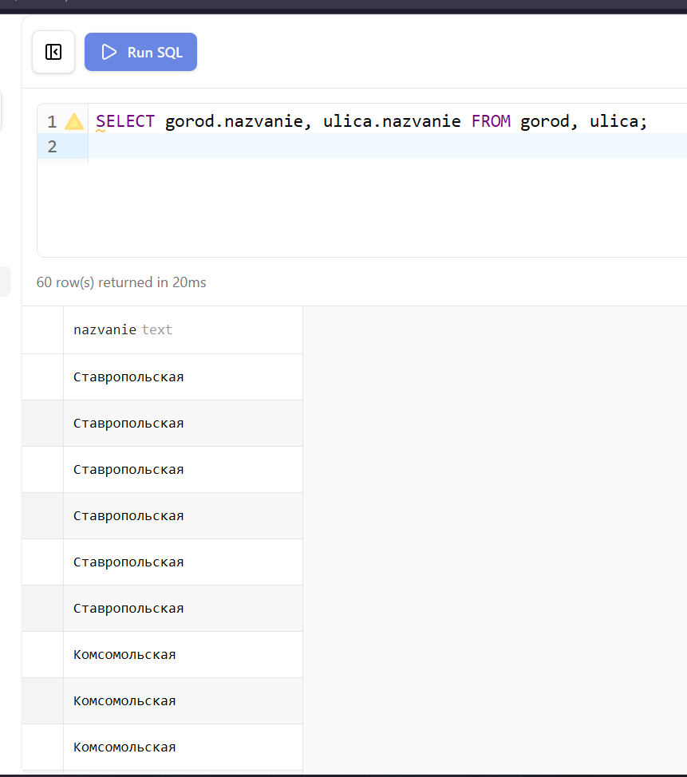

### Задание 8. Вывести названия предметов и фамилии преподавателей

```sql
SELECT dischiplina.nazvanie, prepod.fio_prepod FROM dischiplina, prepod;
```

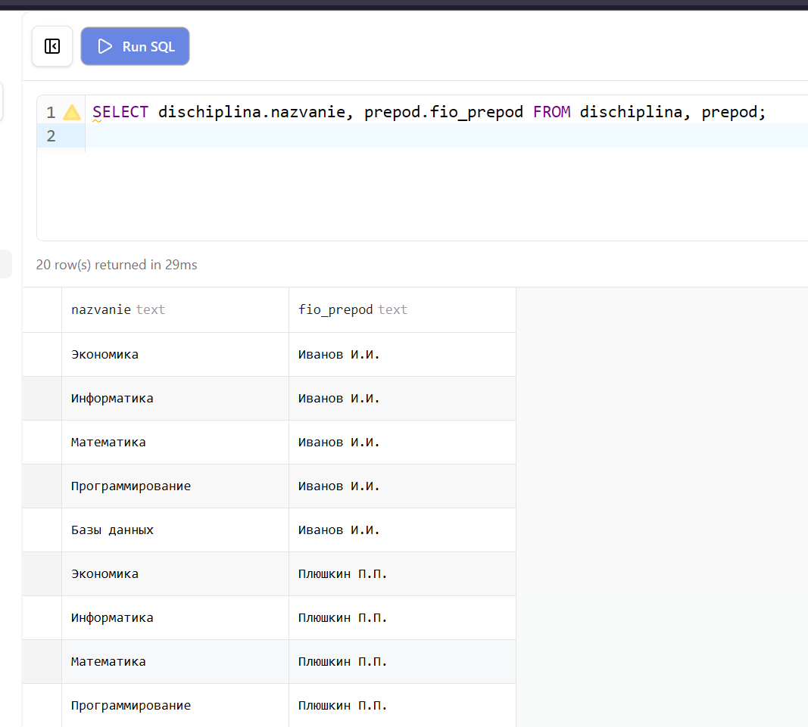

### Задание 9. Вывести фамилии и дату рождения студентов, переименовав поле DATE*ROGNEN в ДЕНЬ*РОЖДЕНИЯ

Псевдоним `AS` позволяет задать альтернативное имя столбца в результате выборки. Псевдоним существует только на время выполнения запроса.

```sql
SELECT fam, date_rognen AS ДЕНЬ_РОЖДЕНИЯ FROM dannie;
```

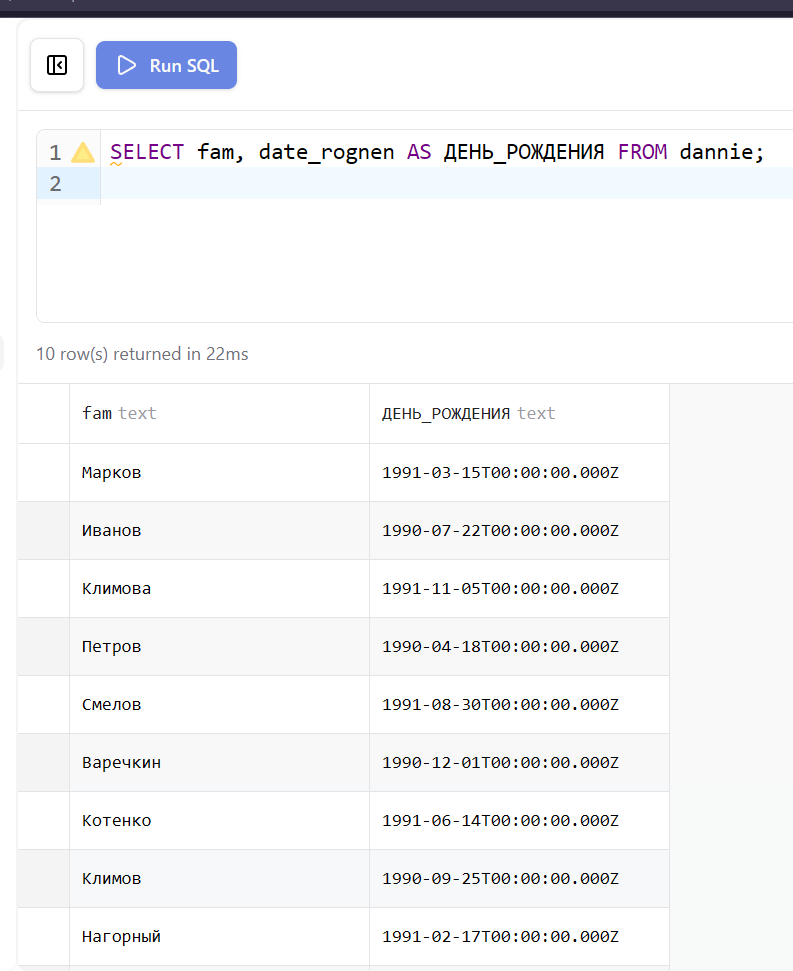

### Задание 10. Вывести названия улиц, переименовав поле NAZVANIE в УЛИЦЫ

```sql
SELECT nazvanie AS УЛИЦЫ FROM ulica;
```

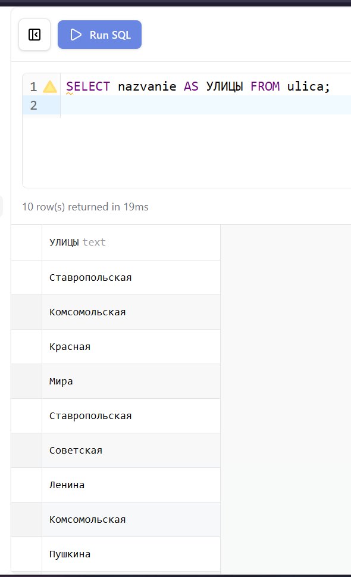

### Задание 11. Вывести список улиц, исключив повторяющиеся значения

Функция `DISTINCT` исключает из результата дублирующиеся строки. В данном случае несколько городов могут иметь улицы с одинаковым названием.

```sql
SELECT DISTINCT nazvanie FROM ulica;
```

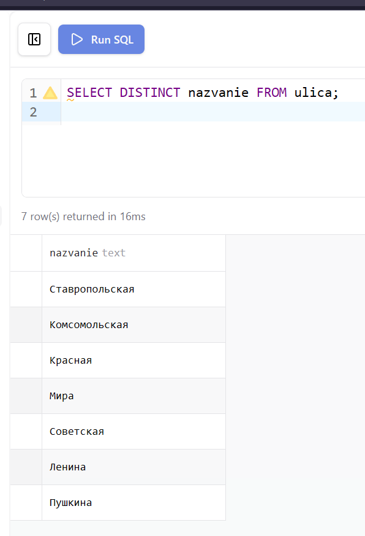

### Задание 12. Вывести различные имена студентов

```sql
SELECT DISTINCT ima FROM dannie;
```

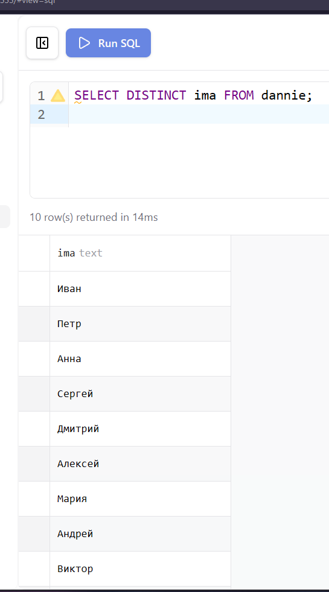

### Задание 13. Вывести первую в списке специальность

Команда `LIMIT 0, 1` означает: начать с позиции 0 (первая строка) и вернуть 1 запись.

```sql
SELECT nazvanie FROM spec LIMIT 0, 1;
```

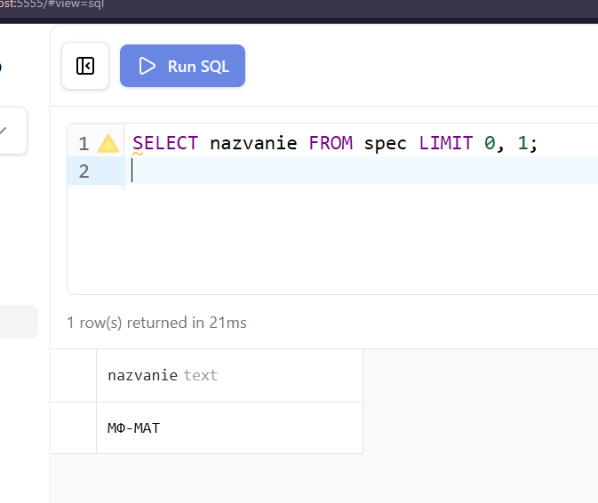

### Задание 14. Вывести с 6 по 10 строки таблицы RODITELI

`LIMIT 5, 5` означает: пропустить 5 строк (начать с 6-й) и вернуть 5 записей.

```sql
SELECT * FROM roditeli LIMIT 5, 5;
```

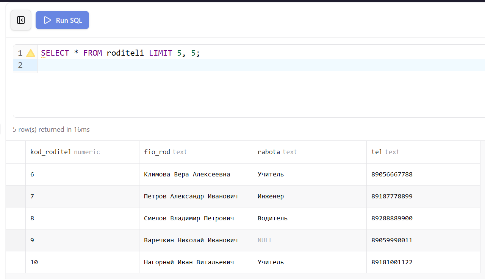

## 5. Проверка результатов

После запуска базы данных командой `docker compose up -d` из папки `lab-02` все таблицы создаются и заполняются автоматически через `init.sql`. Корректность структуры и данных проверяется через Prisma Studio и phpMyAdmin.

В Prisma Studio отображаются все таблицы базы данных с возможностью просмотра содержимого каждой из них и визуализации схемы связей между таблицами.


В phpMyAdmin доступен полный список таблиц базы `lab` с возможностью выполнения произвольных SQL-запросов через вкладку SQL.


Диаграмма связей в Prisma Studio наглядно показывает отношения между всеми 11 таблицами базы данных `student`.


## Вывод

В ходе лабораторной работы освоен базовый синтаксис оператора `SELECT` для выборки данных из одной и нескольких таблиц. Изучены ключевые слова `DISTINCT` для исключения дублирующихся записей, `AS` для переименования полей результата и `LIMIT` для ограничения числа возвращаемых строк. Все запросы выполнены на учебной базе данных `student`, развёрнутой в контейнеризированной среде MySQL.
