**Цель работы:** Научиться создавать запросы с условием, в том числе с использованием логических операторов; научиться сортировать данные по возрастанию и убыванию.

## 1. Настройка среды разработки (Docker Compose)

Лабораторная работа выполняется на той же базе данных `student`, что и предыдущая. База запускается в изолированном контейнере через файл `docker-compose.yml` в папке `lab-03`.

```yaml
services:
  db:
    image: mysql:8.0
    container_name: mysql-lab03
    restart: always
    command:
      [
        "mysqld",
        "--character-set-server=utf8mb4",
        "--collation-server=utf8mb4_unicode_ci",
      ]
    environment:
      MYSQL_ROOT_PASSWORD: secret
      MYSQL_DATABASE: lab
    ports:
      - "3309:3306"
    volumes:
      - lab03-data:/var/lib/mysql
      - ./init.sql:/docker-entrypoint-initdb.d/init.sql
    networks:
      - shared
```

`ports: "3309:3306"` — каждая лабораторная использует уникальный порт хоста, что позволяет запускать несколько лабораторных одновременно без конфликтов.

`volumes: ./init.sql` — монтирует файл схемы напрямую. MySQL автоматически выполняет его при первом запуске контейнера, создавая все таблицы и заполняя их тестовыми данными.

## 2. Теоретические сведения

Предложение `WHERE` позволяет задавать условие фильтрации строк. В условиях можно использовать операторы сравнения `=`, `>`, `<`, `>=`, `<=`, `<>`, а также логические операторы `AND`, `OR`, `NOT`.

Оператор `GROUP BY` группирует записи по значениям одного или нескольких столбцов. Оператор `HAVING` применяется совместно с `GROUP BY` и задаёт фильтр для сформированных групп — в отличие от `WHERE`, который фильтрует отдельные строки.

Для работы с диапазонами значений используется `BETWEEN`, для проверки вхождения в список — `IN` и `NOT IN`, для поиска по шаблону — `LIKE` с символами `%` (любое количество символов) и `_` (один символ). Для проверки на пустое значение применяется `IS NULL`.

Сортировка результатов выполняется с помощью `ORDER BY`. По умолчанию сортировка производится по возрастанию (`ASC`), ключевое слово `DESC` задаёт обратный порядок.

## 3. Выполнение заданий

### Задание 1. Вывести фамилии студентов группы с кодом 3

Предложение `WHERE` фильтрует строки по значению поля `kod_gruppy`. В результат попадают только те записи, для которых условие истинно.

```sql
SELECT fam FROM dannie WHERE kod_gruppy = 3;
```

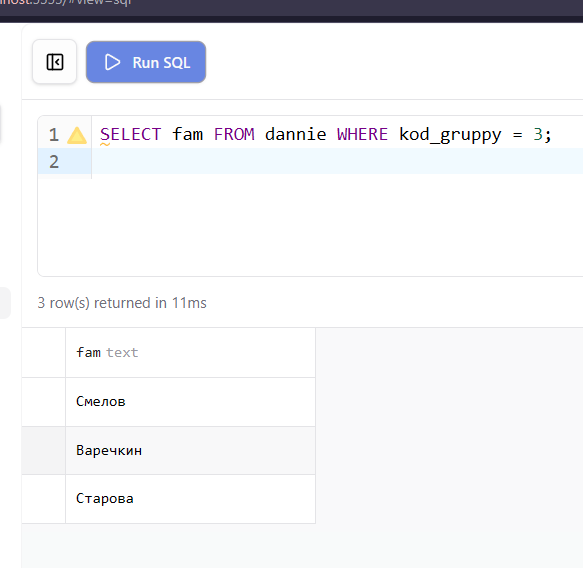{ width=70% }

### Задание 2. Вывести название региона с кодом 1

```sql
SELECT nazvanie FROM region WHERE kod_region = 1;
```

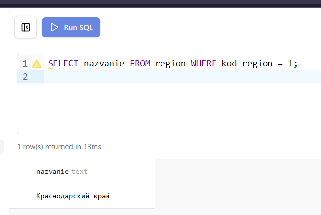{ width=70% }

### Задание 3. Вывести фамилию преподавателя с кодом 2

```sql
SELECT fio_prepod FROM prepod WHERE kod_prepod = 2;
```

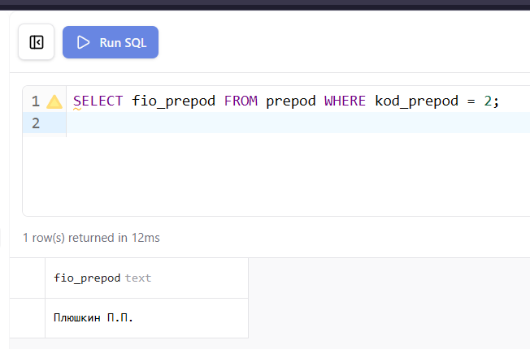{ width=70% }

### Задание 4. Вывести информацию о студентах групп с кодами 1 и 2

Оператор `IN` проверяет, совпадает ли значение поля с одним из значений в списке. Это компактная замена нескольким условиям `OR`.

```sql
SELECT * FROM dannie WHERE kod_gruppy IN (1, 2);
```

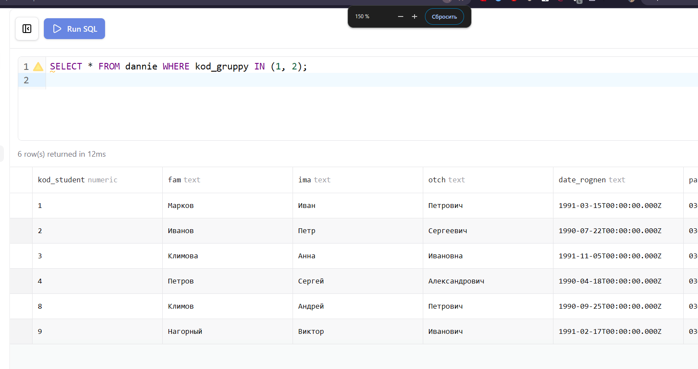{ width=90% }

### Задание 5. Вывести названия дисциплин с кодами 2 и 3

```sql
SELECT nazvanie FROM dischiplina WHERE kod_dischiplina IN (2, 3);
```

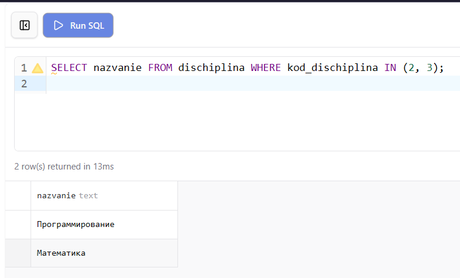{ width=90% }

### Задание 6. Вывести имена студентов, заглавные буквы которых находятся в диапазоне от «В» до «М»

Оператор `BETWEEN` для строковых значений работает по алфавитному порядку. Левая граница включается в диапазон, правая не включается.

```sql
SELECT ima FROM dannie WHERE ima BETWEEN 'В' AND 'М';
```

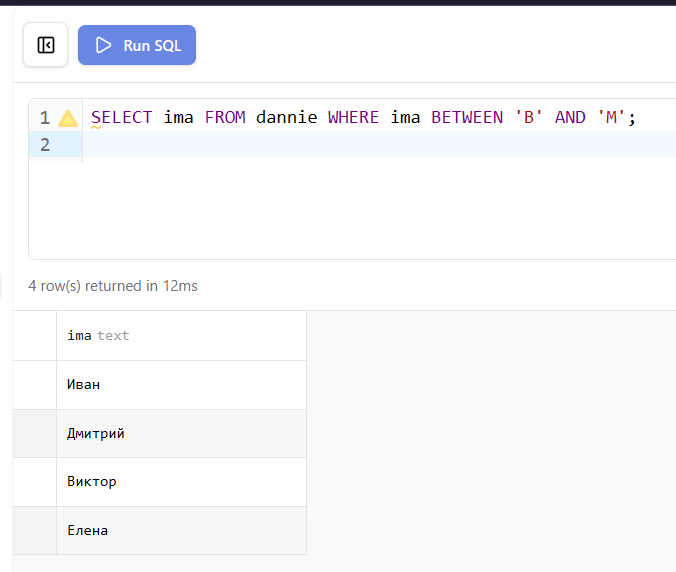{ width=70% }

### Задание 7. Вывести данные о студентах, фамилии которых начинаются на букву «М»

Символ `%` в шаблоне `LIKE` означает любую последовательность символов произвольной длины.

```sql
SELECT * FROM dannie WHERE fam LIKE 'М%';
```

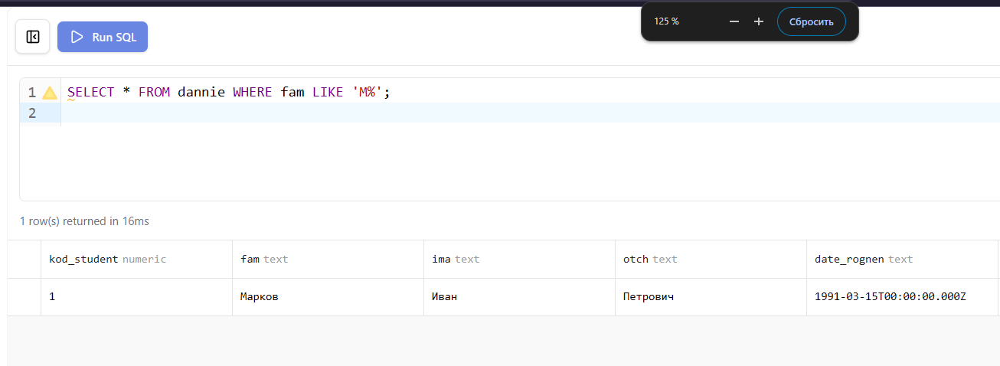{ width=100% }

### Задание 8. Выбрать записи с пустыми значениями номера квартиры

`IS NULL` выбирает строки, в которых указанное поле не содержит значения. Обычный оператор `=` не работает с `NULL` — для этого существует специальная конструкция.

```sql
SELECT * FROM dannie WHERE kvart IS NULL;
```

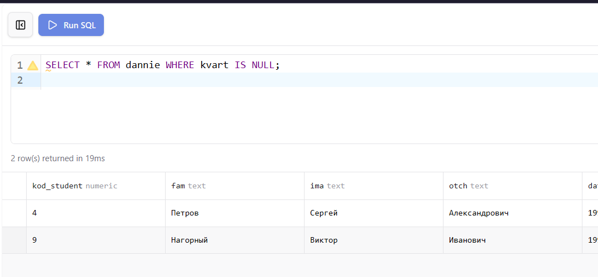{ width=90% }

### Задание 9. Отсортировать фамилии студентов в алфавитном порядке

`ORDER BY` без указания направления использует `ASC` по умолчанию — сортировка по возрастанию, для строк — алфавитный порядок.

```sql
SELECT fam FROM dannie ORDER BY fam;
```

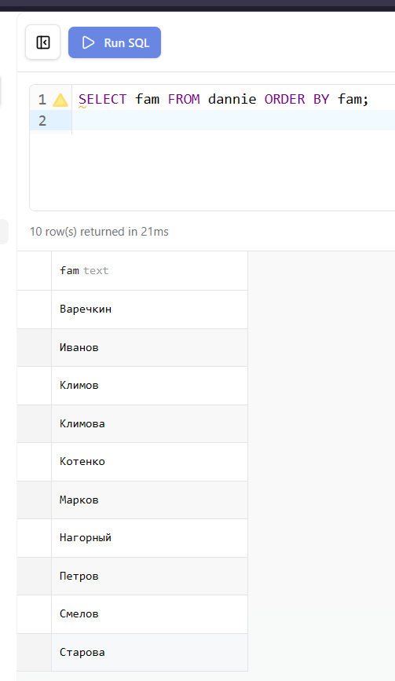{ width=70% }

### Задание 10. Вывести данные о студентах, отсортировав номера телефонов по возрастанию

```sql
SELECT fam, ima, telephone FROM dannie ORDER BY telephone;
```

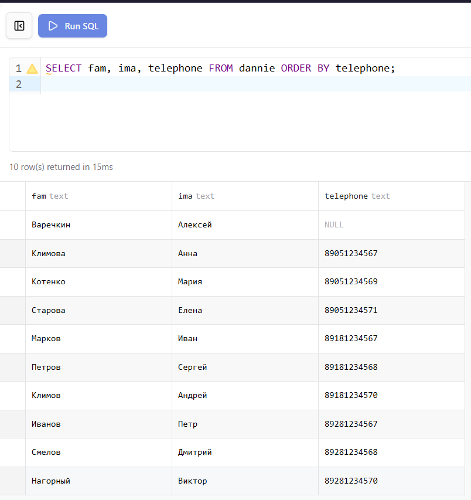{ width=90% }

### Задание 11. Отсортировать студентов по номеру группы по возрастанию, для одинаковых групп — фамилии в обратном алфавитном порядке

При сортировке по нескольким столбцам сначала применяется первый критерий, затем второй — для строк с одинаковым значением первого поля.

```sql
SELECT fam, kod_gruppy FROM dannie ORDER BY kod_gruppy ASC, fam DESC;
```

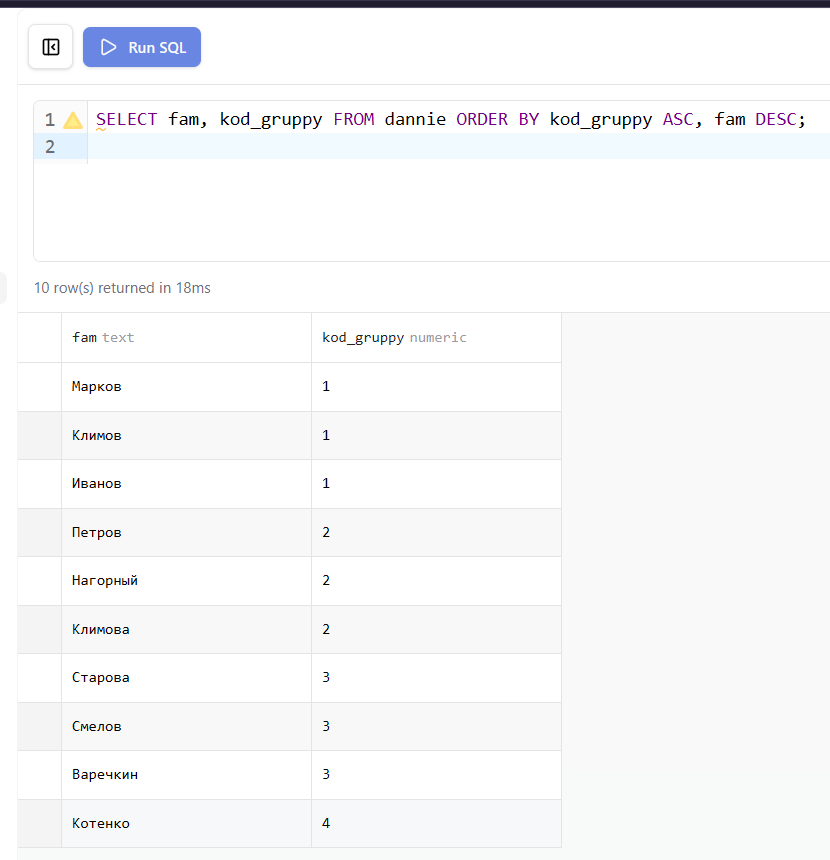{ width=100% }

### Задание 12. Выбрать студентов, фамилии которых заканчиваются на «а»

```sql
SELECT fam FROM dannie WHERE fam LIKE '%а';
```

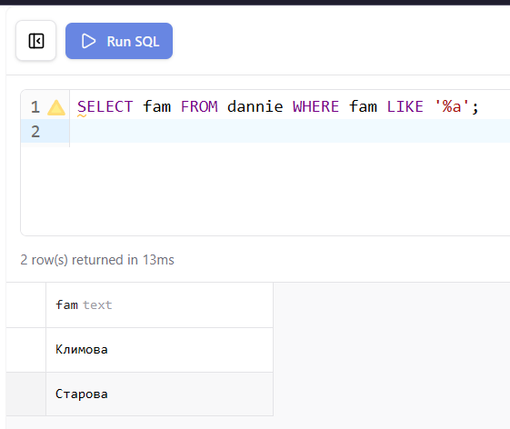{ width=70% }

### Задание 13. Отсортировать по возрастанию фамилии студентов, чьи отчества заканчиваются на «ич»

```sql
SELECT fam, otch FROM dannie WHERE otch LIKE '%ич' ORDER BY fam ASC;
```

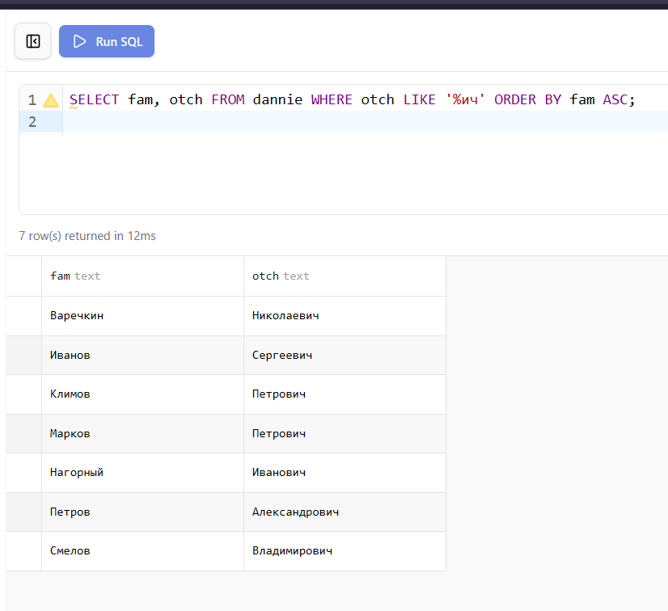{ width=70% }

### Задание 14. Отсортировать по возрастанию фамилии студентов группы 3

```sql
SELECT fam FROM dannie WHERE kod_gruppy = 3 ORDER BY fam ASC;
```

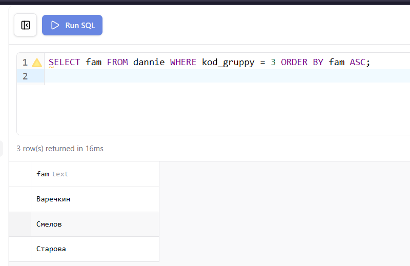{ width=80% }

### Задание 15. Вывести студентов, родившихся в 1990 году

Функция `YEAR()` извлекает год из значения типа `DATE`, что позволяет фильтровать записи по году без указания полной даты.

```sql
SELECT fam, ima, date_rognen FROM dannie WHERE YEAR(date_rognen) = 1990;
```

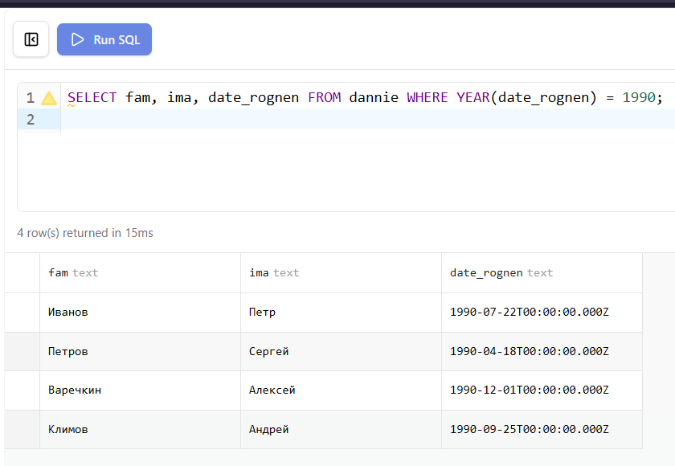{ width=70% }

### Задание 16. Отсортировать фамилии студентов, у которых начальные буквы имени в диапазоне от «И» до «Я»

```sql
SELECT fam, ima FROM dannie WHERE ima BETWEEN 'И' AND 'Я' ORDER BY fam ASC;
```

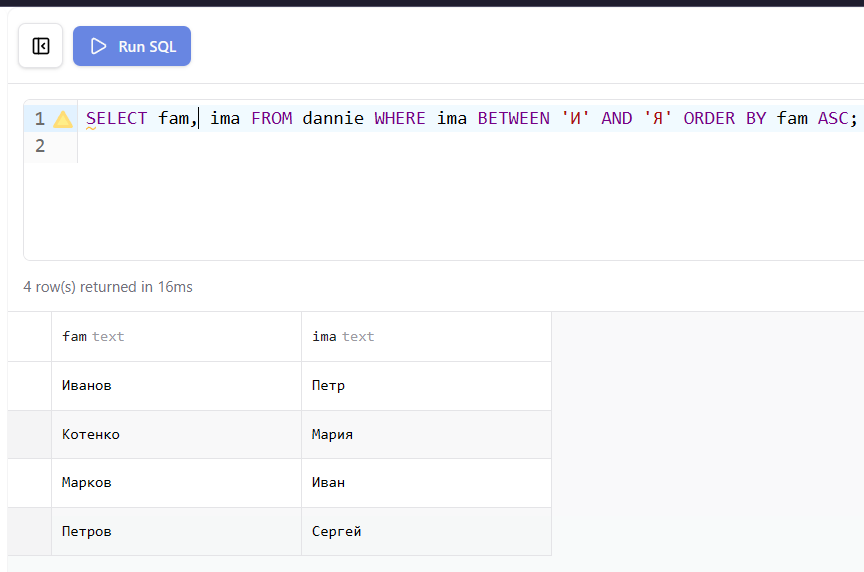{ width=90% }

### Задание 17. Вывести данные о студентах с фамилиями «Петров» и «Смелов»

```sql
SELECT * FROM dannie WHERE fam IN ('Петров', 'Смелов');
```

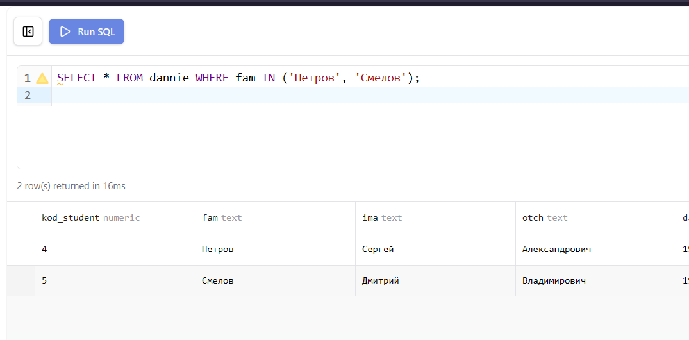{ width=90% }

### Задание 18. Вывести в обратном алфавитном порядке имена и фамилии студентов, родившихся не в 1991 году

```sql
SELECT fam, ima FROM dannie WHERE YEAR(date_rognen) <> 1991 ORDER BY fam DESC;
```

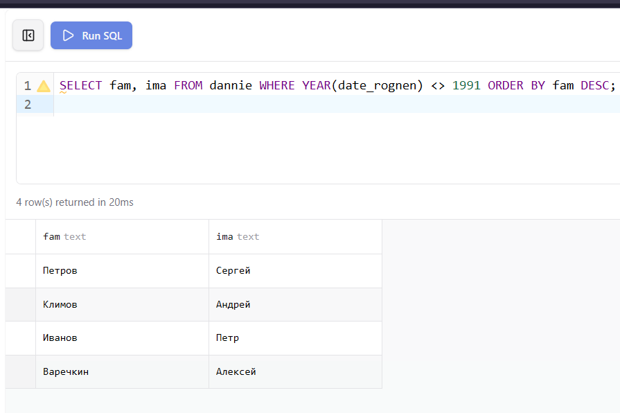{ width=100% }

```{=openxml}
<w:p><w:r><w:br w:type="page"/></w:r></w:p>
```

### Задание 19. Вывести информацию о всех студентах, кроме Варечкина и Климовой

```sql
SELECT * FROM dannie WHERE fam NOT IN ('Варечкин', 'Климова');
```

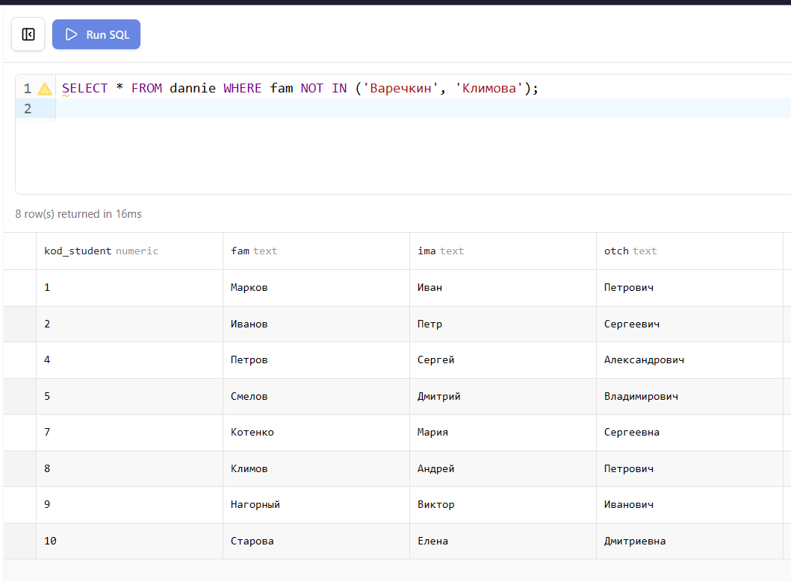{ width=100% }

### Задание 20. Выбрать студентов с номерами телефонов МТС, начинающимися с 3

Номера МТС начинаются с `8918` или `8919`. Шаблон `%3` проверяет, что третья цифра (после `891`) равна `3` — однако точнее использовать `LIKE '8918%'` в сочетании с дополнительным условием.

```sql
SELECT fam, telephone FROM dannie
WHERE (telephone LIKE '8918%' OR telephone LIKE '8919%')
  AND telephone LIKE '8918%3%';
```

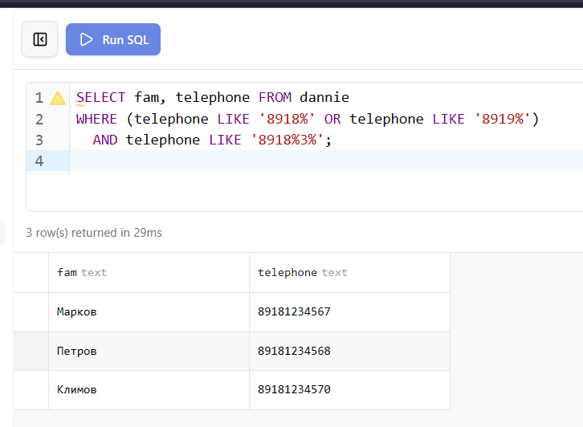{ width=100% }

### Задание 21. Сгруппировать список улиц по коду города

`GROUP BY` собирает строки с одинаковым значением указанного поля в группы. Здесь улицы группируются по коду города, к которому они относятся.

```sql
SELECT kod_gorod, nazvanie FROM ulica GROUP BY kod_gorod, nazvanie;
```

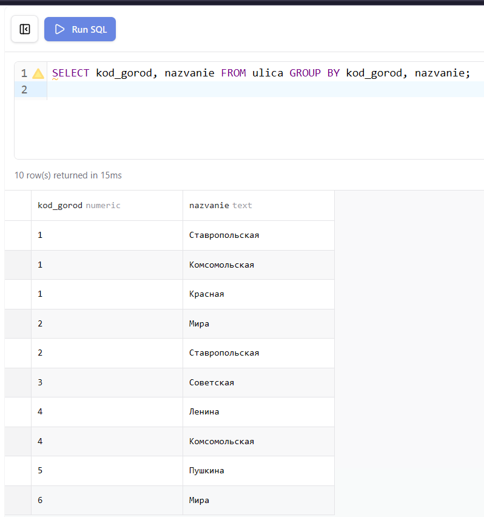{ width=100% }

### Задание 22. Сгруппировать данные о студентах по дате рождения

```sql
SELECT date_rognen, fam, ima FROM dannie GROUP BY date_rognen, fam, ima;
```

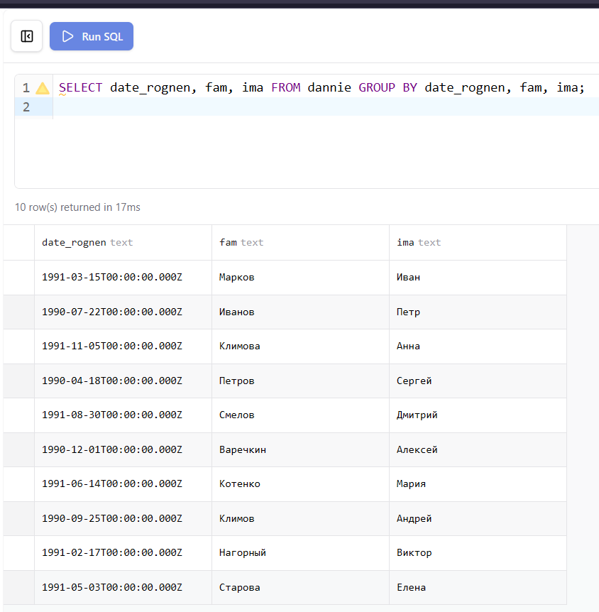{ width=100% }

### Задание 23. Вывести по группам коды городов для улиц Ставропольская и Комсомольская

`HAVING` фильтрует уже сформированные группы — в отличие от `WHERE`, который фильтрует строки до группировки.

```sql
SELECT kod_gorod, nazvanie FROM ulica
GROUP BY kod_gorod, nazvanie
HAVING nazvanie IN ('Ставропольская', 'Комсомольская');
```

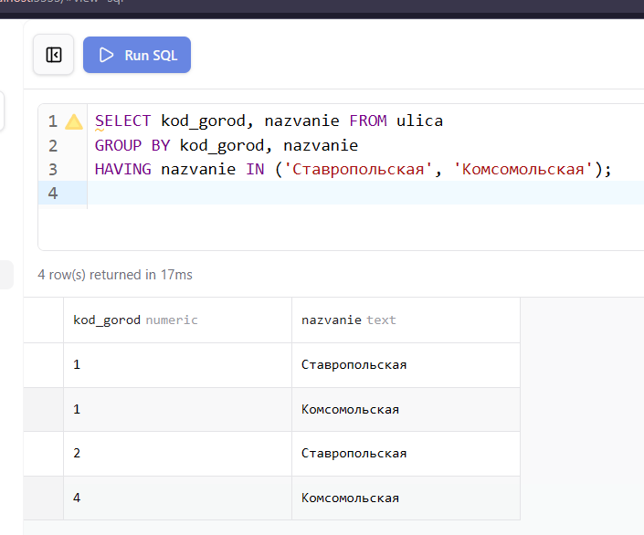{ width=80% }

### Задание 24. Сгруппировать по улицам данные о студентах группы с кодом 1

```sql
SELECT kod_ulica, fam, ima FROM dannie
WHERE kod_gruppy = 1
GROUP BY kod_ulica, fam, ima;
```

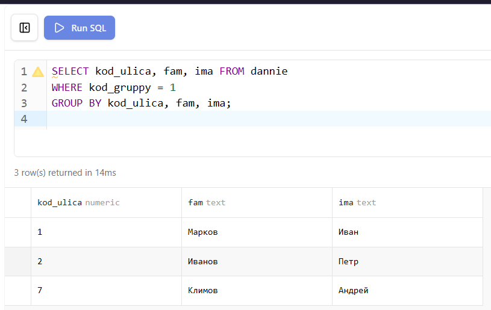{ width=80% }

### Задание 25. Отсортировать фамилии студентов, у которых в отчестве встречается «ев»

Шаблон `%ев%` находит строки, содержащие подстроку `ев` в любом месте.

```sql
SELECT fam, otch FROM dannie WHERE otch LIKE '%ев%' ORDER BY fam ASC;
```

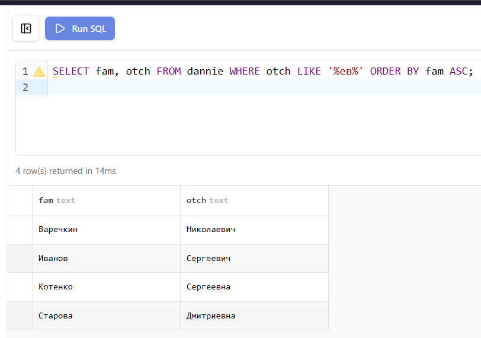{ width=100% }

## 4. Проверка результатов

После запуска базы данных командой `docker compose up -d` из папки `lab-03` все таблицы создаются и заполняются автоматически. Корректность структуры и данных проверяется через Prisma Studio и phpMyAdmin.

Prisma Studio отображает все таблицы с данными и позволяет визуально проверить связи между ними.

{ width=80% }

phpMyAdmin предоставляет возможность выполнять SQL-запросы напрямую через вкладку SQL и просматривать результаты в табличном виде.

{ width=80% }

Диаграмма связей в Prisma Studio наглядно показывает отношения между всеми таблицами базы данных.

{ width=80% }

## Вывод

В ходе лабораторной работы освоено применение предложения `WHERE` для фильтрации строк по условию с использованием операторов сравнения и логических операторов `AND`, `OR`, `NOT`. Изучены специализированные операторы `IN`, `BETWEEN`, `LIKE` и `IS NULL`, а также механизмы группировки данных через `GROUP BY` и `HAVING`. Отработана сортировка результатов запросов по одному и нескольким столбцам с помощью `ORDER BY`.
