**Цель работы:** Научиться находить сумму полей, максимальное, минимальное, среднее значения полей, подсчитывать количество записей с использованием агрегированных функций MySQL.

# 1. Настройка среды разработки (Docker Compose)

Лабораторная работа выполняется на базе данных `student`, запущенной в изолированном контейнере через файл `docker-compose.yml` в папке `lab-04`.

```yaml
services:
  db:
    image: mysql:8.0
    container_name: mysql-lab04
    restart: always
    command:
      [
        "mysqld",
        "--character-set-server=utf8mb4",
        "--collation-server=utf8mb4_unicode_ci",
      ]
    environment:
      MYSQL_ROOT_PASSWORD: secret
      MYSQL_DATABASE: lab
    ports:
      - "3310:3306"
    volumes:
      - lab04-data:/var/lib/mysql
      - ../student-init.sql:/docker-entrypoint-initdb.d/init.sql
    networks:
      - shared
```

`ports: "3310:3306"` — уникальный порт хоста для лабораторной №4, исключающий конфликты при одновременном запуске нескольких лабораторных работ.

`volumes: ../student-init.sql` — монтирует общий файл схемы базы данных, расположенный в корне проекта. Это исключает дублирование кода: все лабораторные работы с №2 по №11 используют одну и ту же схему `student`.

# 2. Теоретические сведения

Агрегированные функции применяются в предложении `SELECT` и вычисляют одно значение на основе набора строк. Функция `COUNT` подсчитывает количество строк или не-NULL значений. Функция `SUM` вычисляет сумму числовых значений поля. Функция `AVG` возвращает среднее арифметическое выбранных значений. Функции `MAX` и `MIN` находят наибольшее и наименьшее значения соответственно — они применимы как к числовым, так и к строковым полям.

Агрегированные функции часто используются совместно с `GROUP BY` для вычисления значений в пределах каждой группы, а также с `HAVING` для фильтрации групп по результату агрегации. Ключевое слово `AS` позволяет задать псевдоним для вычисляемого поля, что делает результат более читаемым.

# 3. Выполнение заданий

## Задание 1. Найти среднее значение оценок по каждому студенту

Функция `AVG` вычисляет среднее арифметическое всех значений поля `ocenka` в пределах каждой группы, образованной по `kod_student`. Псевдоним `AS` делает заголовок результирующего столбца понятным.

```sql
SELECT kod_student, AVG(ocenka) AS СРЕДНЯЯ_ОЦЕНКА
FROM uspev
GROUP BY kod_student;
```

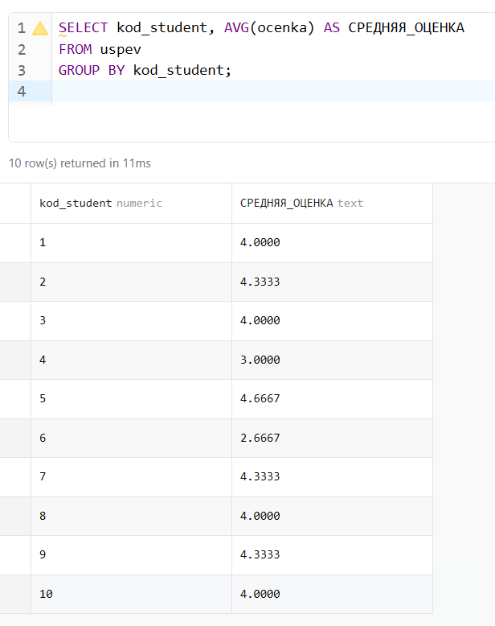{ width=60% }

## Задание 2. Найти максимальную оценку по каждой дисциплине

```sql
SELECT kod_dischiplina, MAX(ocenka) AS МАКСИМАЛЬНАЯ_ОЦЕНКА
FROM uspev
GROUP BY kod_dischiplina;
```

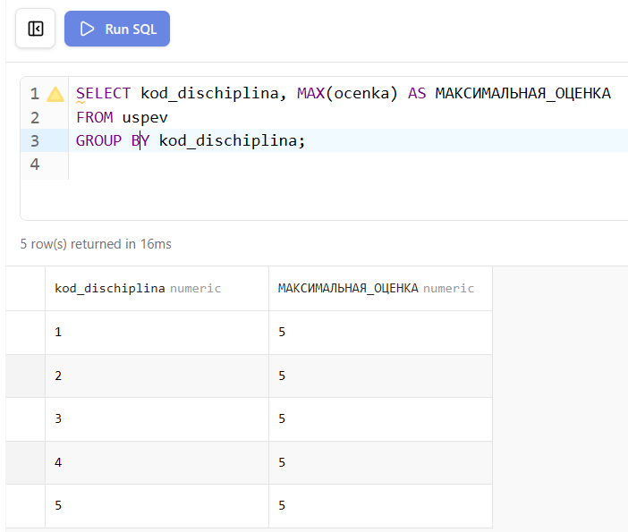{ width=100% }

## Задание 3. Найти среднюю оценку, выставленную каждым преподавателем

```sql
SELECT kod_prepod, AVG(ocenka) AS СРЕДНЯЯ_ОЦЕНКА
FROM uspev
GROUP BY kod_prepod;
```

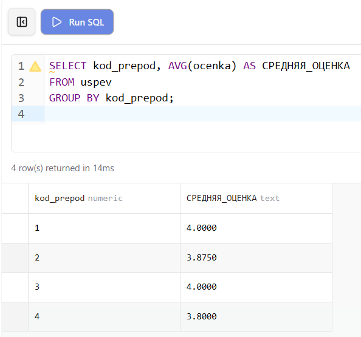

## Задание 4. Вывести минимальную оценку, выставленную каждым преподавателем

```sql
SELECT kod_prepod, MIN(ocenka) AS МИНИМАЛЬНАЯ_ОЦЕНКА
FROM uspev
GROUP BY kod_prepod;
```

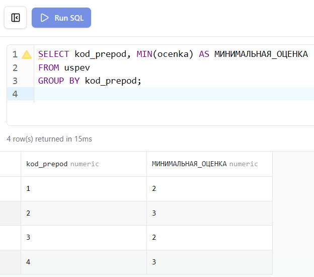

## Задание 5. Перевести каждую оценку в рейтинговый балл

Оценка больше 3 баллов увеличивается в 2 раза. Арифметические выражения в `SELECT` применяются к каждой строке результата. Условный оператор `IF` позволяет задать разную логику для разных значений.

```sql
SELECT kod_student, ocenka,
  IF(ocenka > 3, ocenka * 2, ocenka) AS РЕЙТИНГОВЫЙ_БАЛ
FROM uspev;
```

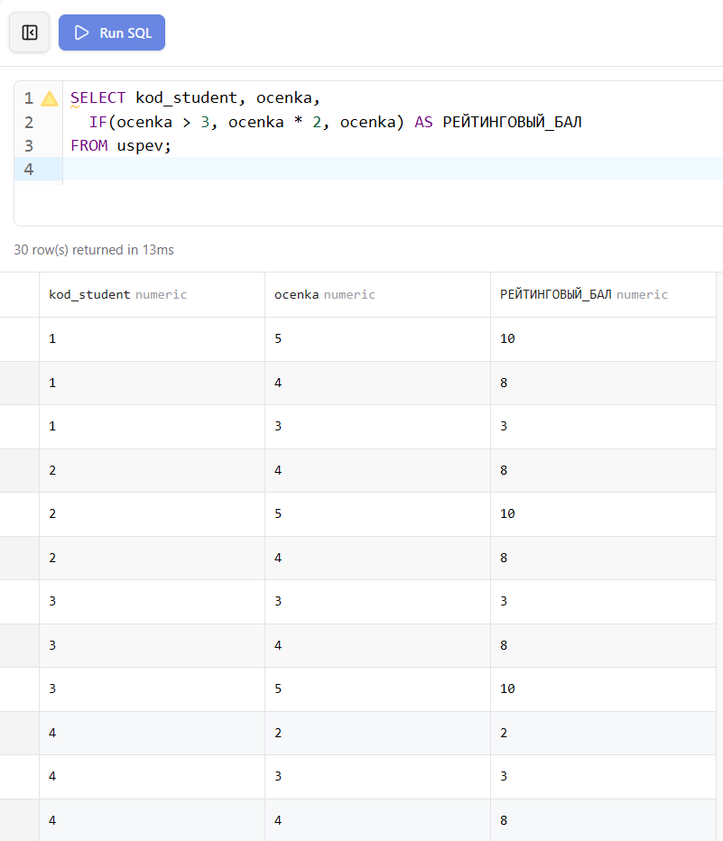{ width=100% }

## Задание 6. Подсчитать количество разных групп

`COUNT(DISTINCT ...)` подсчитывает только уникальные значения поля, исключая дубликаты.

```sql
SELECT COUNT(DISTINCT kod_gruppy) AS КОЛИЧЕСТВО_ГРУПП
FROM dannie;
```

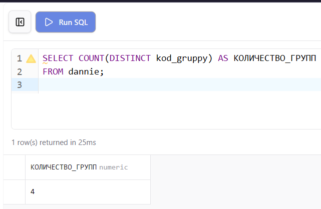{ width=80% }

## Задание 7. Подсчитать количество различных квартир

```sql
SELECT COUNT(DISTINCT kvart) AS КОЛИЧЕСТВО_КВАРТИР
FROM dannie
WHERE kvart IS NOT NULL;
```

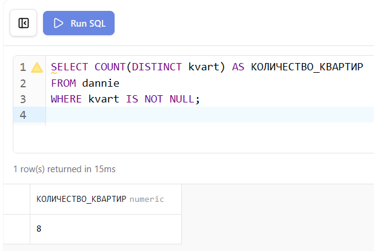{ width=80% }

## Задание 8. Вывести среднюю, максимальную и минимальную оценку для студента с кодом 3

Несколько агрегированных функций можно использовать в одном запросе, применяя фильтрацию через `WHERE` до группировки.

```sql
SELECT
  AVG(ocenka) AS СРЕДНЯЯ,
  MAX(ocenka) AS МАКСИМАЛЬНАЯ,
  MIN(ocenka) AS МИНИМАЛЬНАЯ
FROM uspev
WHERE kod_student = 3;
```

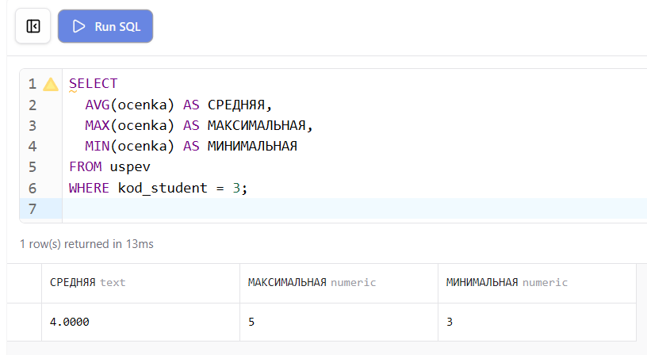{ width=100% }

## Задание 9. Подсчитать количество хороших оценок

Хорошими считаются оценки 4 и 5. Фильтрация через `WHERE` применяется до агрегации.

```sql
SELECT COUNT(*) AS ХОРОШИЕ_ОЦЕНКИ
FROM uspev
WHERE ocenka >= 4;
```

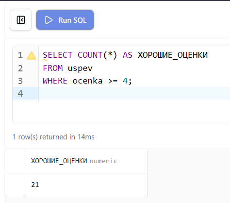{ width=100% }

## Задание 10. Подсчитать процент двоек, выставленных каждым преподавателем

Процент вычисляется как отношение количества двоек к общему числу оценок преподавателя, умноженное на 100. Вложенный подзапрос или условное выражение позволяет посчитать двойки внутри группы.

```sql
SELECT
  kod_prepod,
  COUNT(*) AS ВСЕГО_ОЦЕНОК,
  SUM(IF(ocenka = 2, 1, 0)) AS ДВОЕК,
  ROUND(SUM(IF(ocenka = 2, 1, 0)) * 100.0 / COUNT(*), 2) AS ПРОЦЕНТ_ДВОЕК
FROM uspev
GROUP BY kod_prepod;
```

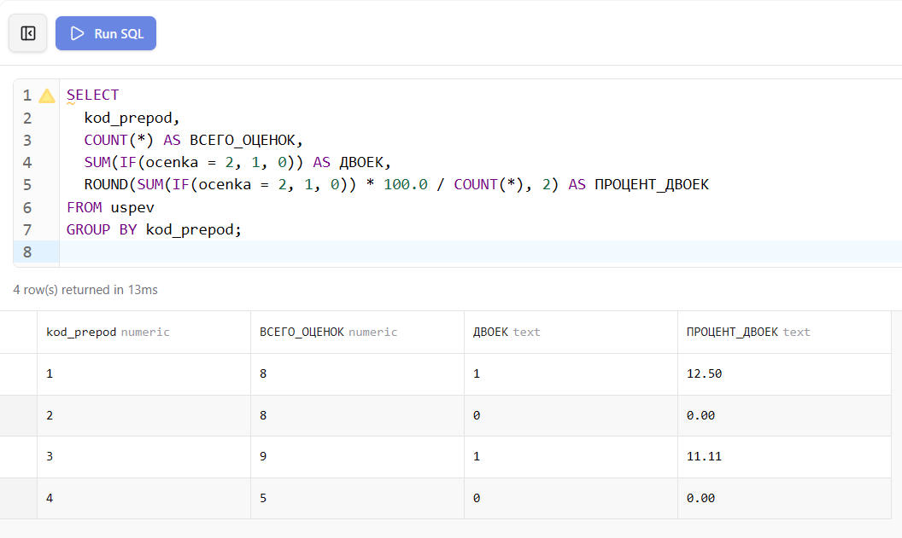{ width=90% }

## Задание 11. Посчитать количество и сумму пятёрок и четвёрок

```sql
SELECT
  COUNT(*)        AS КОЛИЧЕСТВО,
  SUM(ocenka)     AS СУММА
FROM uspev
WHERE ocenka IN (4, 5);
```

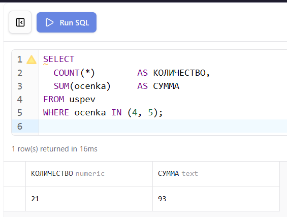{ width=80% }

## Задание 12. Подсчитать процент качества и процент успеваемости

Процент качества — доля оценок 4 и 5 от общего числа. Процент успеваемости — доля оценок 3, 4 и 5 от общего числа. Общее количество оценок равно 26 согласно условию задания.

```sql
SELECT
  ROUND(SUM(IF(ocenka >= 4, 1, 0)) * 100.0 / 26, 2) AS ПРОЦЕНТ_КАЧЕСТВА,
  ROUND(SUM(IF(ocenka >= 3, 1, 0)) * 100.0 / 26, 2) AS ПРОЦЕНТ_УСПЕВАЕМОСТИ
FROM uspev;
```

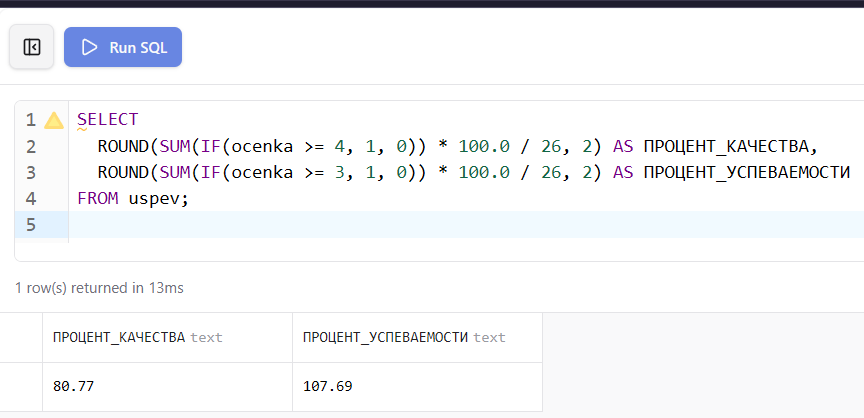{ width=100% }

## Задание 13. На скольких улицах проживают более 1 студента

`HAVING COUNT(*) > 1` фильтрует группы после агрегации, оставляя только те улицы, на которых живёт более одного студента.

```sql
SELECT kod_ulica, COUNT(*) AS КОЛИЧЕСТВО_СТУДЕНТОВ
FROM dannie
GROUP BY kod_ulica
HAVING COUNT(*) > 1;
```

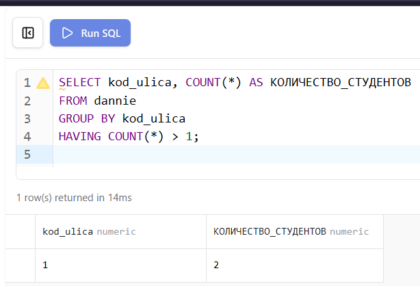{ width=70% }

## Задание 14. Вывести количество оценок, для которых выполняется условие «оценка×2+1>10»

```sql
SELECT COUNT(*) AS КОЛИЧЕСТВО
FROM uspev
WHERE ocenka * 2 + 1 > 10;
```

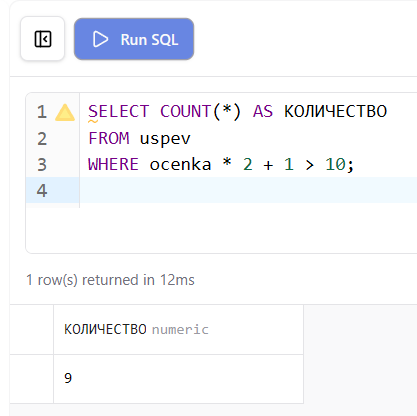{ width=70% }

# 4. Проверка результатов

После запуска базы данных командой `docker compose up -d` из папки `lab-04` все таблицы создаются и заполняются автоматически из общего файла `student-init.sql`. Корректность структуры и данных проверяется через Prisma Studio и phpMyAdmin.

Prisma Studio отображает все таблицы с данными и позволяет визуально проверить структуру базы и связи между таблицами.

{ width=100% }

phpMyAdmin предоставляет возможность выполнять SQL-запросы напрямую и просматривать результаты в табличном виде.

{ width=100% }

Диаграмма связей в Prisma Studio наглядно показывает отношения между всеми таблицами базы данных `student`.

{ width=100% }

```{=openxml}
<w:p><w:r><w:br w:type="page"/></w:r></w:p>
```

# Вывод

В ходе лабораторной работы освоено применение агрегированных функций `COUNT`, `SUM`, `AVG`, `MAX` и `MIN` для вычисления статистических характеристик наборов данных. Изучено использование этих функций совместно с `GROUP BY` для группировки результатов и `HAVING` для фильтрации сформированных групп. Отработано вычисление производных показателей — рейтинговых баллов и процентных соотношений — с применением условных выражений `IF` внутри агрегатных функций.
