**Цель работы:** Познакомиться с основными строковыми и числовыми функциями MySQL: UCASE, LCASE, CONCAT, INSERT, LENGTH, REPEAT, REPLACE, REVERSE, POSITION, ABS, MOD, SQRT, FLOOR, CEIL.

# 1. Настройка среды разработки (Docker Compose)

Лабораторная работа выполняется на базе данных `student`, запущенной в изолированном контейнере через файл `docker-compose.yml` в папке `lab-05`.

```yaml
services:
  db:
    image: mysql:8.0
    container_name: mysql-lab05
    restart: always
    command:
      [
        "mysqld",
        "--character-set-server=utf8mb4",
        "--collation-server=utf8mb4_unicode_ci",
      ]
    environment:
      MYSQL_ROOT_PASSWORD: secret
      MYSQL_DATABASE: lab
    ports:
      - "3311:3306"
    volumes:
      - lab05-data:/var/lib/mysql
      - ../student-init.sql:/docker-entrypoint-initdb.d/init.sql
    networks:
      - shared
```

`ports: "3311:3306"` — уникальный порт хоста для лабораторной №5, исключающий конфликты при одновременном запуске нескольких лабораторных работ.

`volumes: ../student-init.sql` — монтирует общий файл схемы базы данных из корня проекта. Все лабораторные работы с №2 по №11 используют одну и ту же схему `student`.

# 2. Теоретические сведения

Строковые функции MySQL позволяют преобразовывать, извлекать и объединять текстовые данные непосредственно в SQL-запросе. Функции `UCASE` и `LCASE` переводят строку в верхний и нижний регистр соответственно. Функция `CONCAT` объединяет несколько строк в одну. Функция `INSERT(str, pos, len, new_str)` заменяет подстроку длиной `len` символов начиная с позиции `pos` на `new_str`. Функция `LENGTH` возвращает длину строки в байтах. Функция `REPEAT(str, n)` повторяет строку `n` раз. Функция `REPLACE(str, s1, s2)` заменяет все вхождения подстроки `s1` на `s2`. Функция `REVERSE` записывает строку в обратном порядке.

Среди числовых функций `POSITION('подстрока' IN 'строка')` возвращает позицию первого вхождения подстроки. Функция `ABS` возвращает абсолютное значение числа. Функция `MOD(a, b)` возвращает остаток от деления `a` на `b`. Функция `SQRT` вычисляет квадратный корень. Функции `FLOOR` и `CEIL` округляют число в меньшую и большую сторону соответственно.

# 3. Выполнение заданий

## Задание 1. Вывести фамилии родителей заглавными буквами

Функция `UCASE` преобразует все символы строки в верхний регистр. Результирующий столбец переименовывается через `AS` для удобства чтения.

```sql
SELECT UCASE(fio_rod) AS ФАМИЛИЯ FROM roditeli;
```

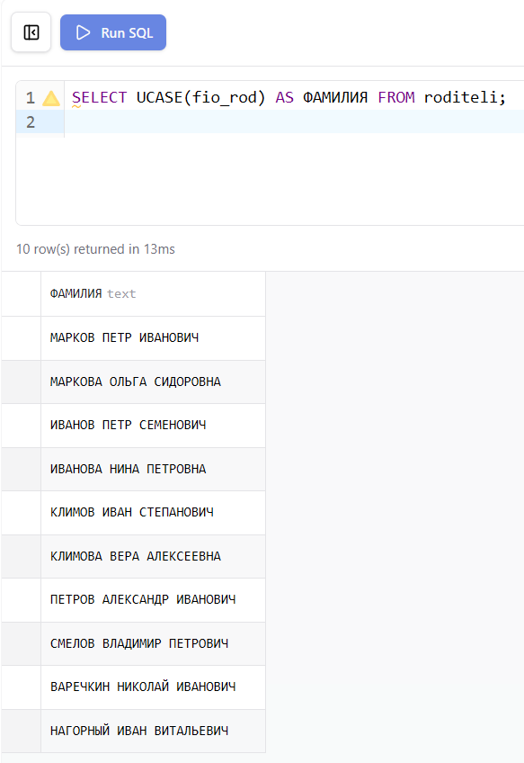{ width=80% }

## Задание 2. Вывести названия улиц маленькими буквами

```sql
SELECT LCASE(nazvanie) AS УЛИЦА FROM ulica;
```

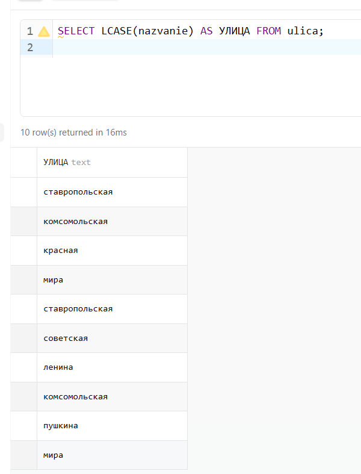{ width=80% }

## Задание 3. Вывести названия факультетов, курс и группу

Из полного названия группы формата `МФ-МАТ-4-1` необходимо вырезать название специальности и получить `МФ-4-1`. Функция `INSERT` заменяет среднюю часть строки (название специальности) на пустую строку, оставляя только факультет, курс и номер группы.

```sql
SELECT nazvanie,
  CONCAT(
    SUBSTRING_INDEX(nazvanie, '-', 1),
    '-',
    SUBSTRING_INDEX(nazvanie, '-', -2)
  ) AS КРАТКОЕ_НАЗВАНИЕ
FROM gruppa;
```

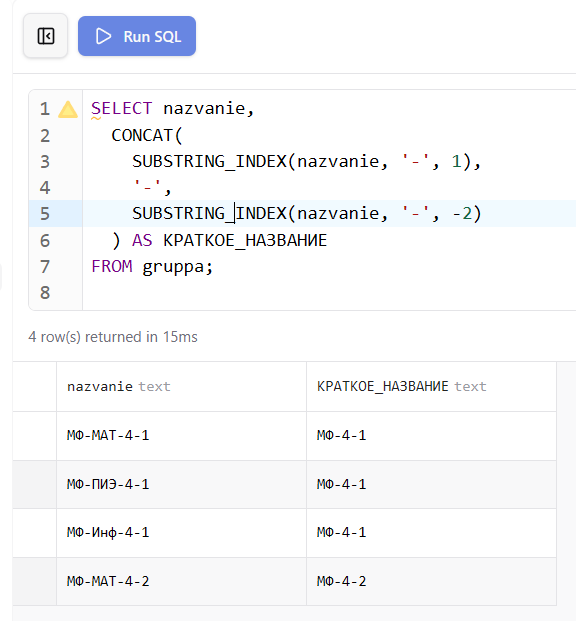{ width=80% }

## Задание 4. Вывести данные о родителях, разместив работу и телефон в одном поле

Функция `CONCAT` объединяет несколько полей в одну строку. Между значениями добавляется разделитель для удобства чтения.

```sql
SELECT fio_rod, CONCAT(rabota, ' / ', tel) AS РАБОТА_И_ТЕЛЕФОН
FROM roditeli;
```

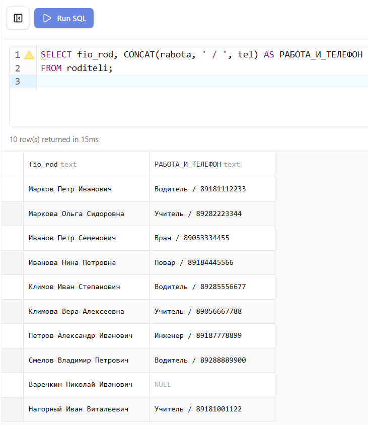{ width=100% }

## Задание 5. Вывести имя, отчество, телефон студента и количество символов в них

Функция `LENGTH` возвращает длину строки в байтах. Для кириллических символов в кодировке UTF-8 каждый символ занимает 2 байта, поэтому для подсчёта символов используется `CHAR_LENGTH`.

```sql
SELECT ima, otch, telephone,
  CHAR_LENGTH(ima)       AS ДЛ_ИМЕНИ,
  CHAR_LENGTH(otch)      AS ДЛ_ОТЧЕСТВА,
  CHAR_LENGTH(telephone) AS ДЛ_ТЕЛЕФОНА
FROM dannie;
```

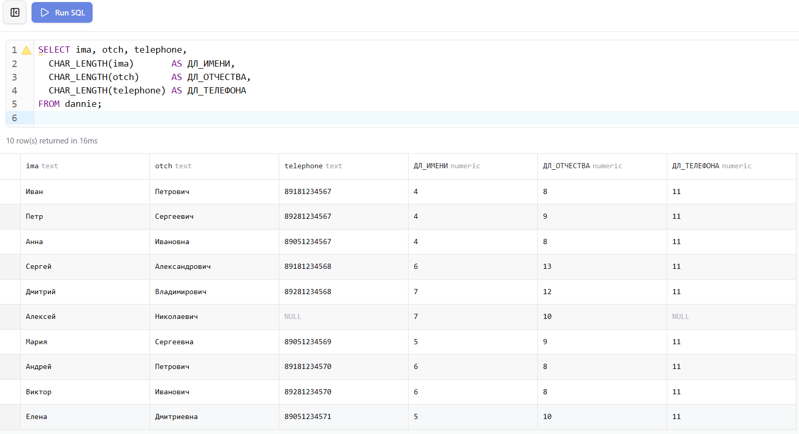{ width=100% }

## Задание 6. Вывести номер телефона в обратном порядке

Функция `REVERSE` записывает строку в обратном порядке символов.

```sql
SELECT telephone, REVERSE(telephone) AS ТЕЛЕФОН_ОБРАТНО
FROM dannie
WHERE telephone IS NOT NULL;
```

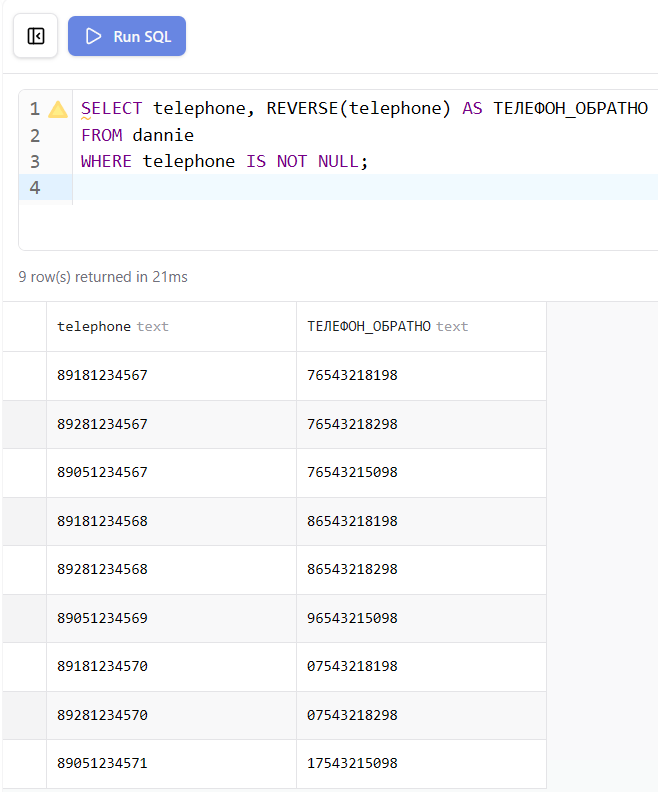{ width=100% }

## Задание 7. Вывести дату рождения 5 раз в одном поле

Функция `REPEAT(str, n)` повторяет строку `str` ровно `n` раз подряд без разделителей.

```sql
SELECT fam, REPEAT(date_rognen, 5) AS ДАТА_5_РАЗ
FROM dannie;
```

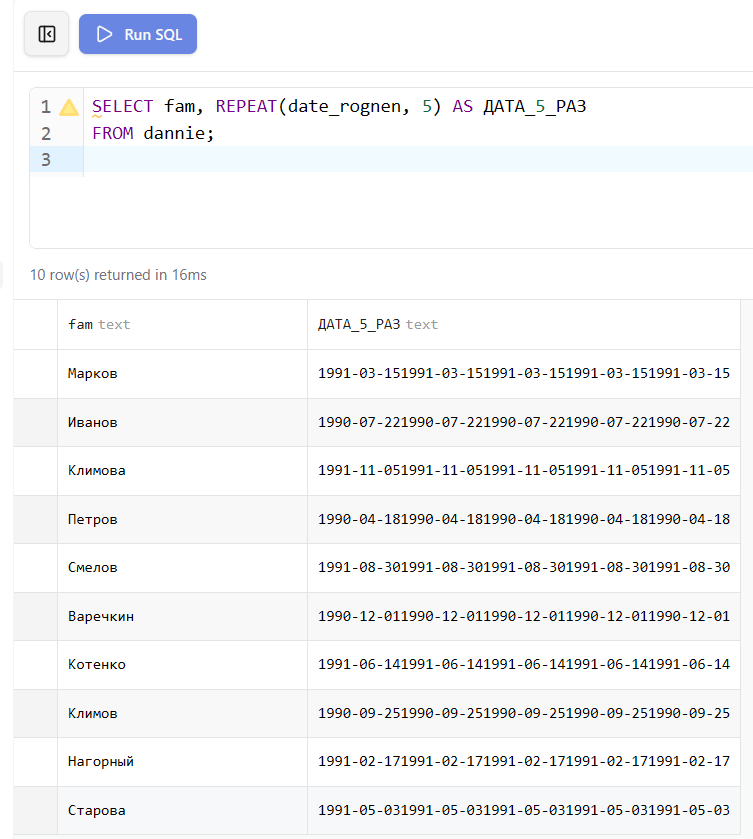{ width=100% }

## Задание 8. Заменить 1991 год рождения на 91

Функция `REPLACE(str, s1, s2)` заменяет все вхождения подстроки `s1` на `s2` в строке `str`.

```sql
SELECT fam, REPLACE(date_rognen, '1991', '91') AS ДАТА_КОРОТКАЯ
FROM dannie;
```

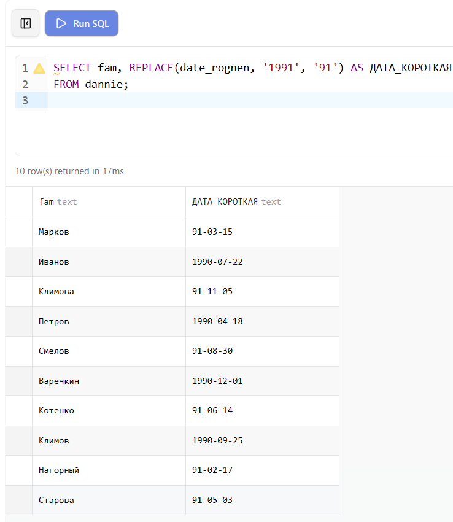{ width=100% }

## Задание 9. Вывести количество студентов с серией паспорта 03 01

Функция `POSITION` возвращает позицию первого вхождения подстроки в строке. Если подстрока найдена, возвращается число больше 0.

```sql
SELECT COUNT(*) AS КОЛИЧЕСТВО
FROM dannie
WHERE POSITION('03 01' IN pasp_dannie) > 0;
```

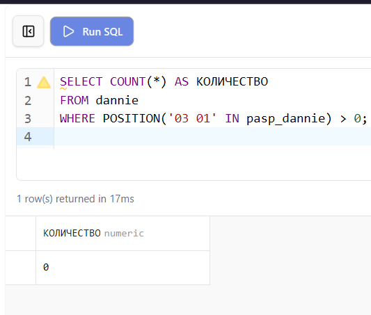{ width=100% }

## Задание 10. Найти |38-20-168| используя числовые функции

Функция `ABS` возвращает абсолютное значение числового выражения.

```sql
SELECT ABS(38 - 20 - 168) AS РЕЗУЛЬТАТ;
```

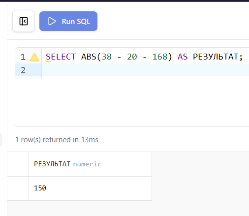{ width=100% }

## Задание 11. Найти остаток от деления 16 на 5

Функция `MOD(a, b)` возвращает остаток от целочисленного деления `a` на `b`.

```sql
SELECT MOD(16, 5) AS ОСТАТОК;
```

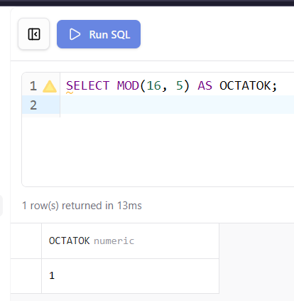{ width=100% }

## Задание 12. Вычислить √22500

Функция `SQRT` возвращает арифметический квадратный корень из числа.

```sql
SELECT SQRT(22500) AS КОРЕНЬ;
```

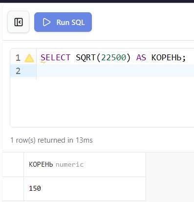{ width=100% }

## Задание 13. Округлить числа в меньшую и большую сторону

Функция `FLOOR` округляет число в меньшую сторону (отбрасывает дробную часть). Функция `CEIL` округляет в большую сторону (следующее целое число).

```sql
SELECT
  FLOOR(5.128) AS FLOOR_5_128,
  CEIL(5.265)  AS CEIL_5_265;
```

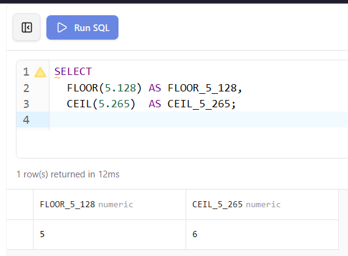{ width=100% }

# 4. Проверка результатов

После запуска базы данных командой `docker compose up -d` из папки `lab-05` все таблицы создаются и заполняются автоматически из общего файла `student-init.sql`. Корректность структуры и данных проверяется через Prisma Studio и phpMyAdmin.

Prisma Studio отображает все таблицы с данными и позволяет визуально проверить структуру базы и связи между таблицами.

{ width=80% }

phpMyAdmin предоставляет возможность выполнять SQL-запросы напрямую и просматривать результаты в табличном виде.

{ width=80% }

Диаграмма связей в Prisma Studio наглядно показывает отношения между всеми таблицами базы данных `student`.

{ width=80% }

## Вывод

В ходе лабораторной работы освоены основные строковые функции MySQL: `UCASE`, `LCASE`, `CONCAT`, `INSERT`, `LENGTH`, `REPEAT`, `REPLACE`, `REVERSE` и `POSITION`. Изучены числовые функции `ABS`, `MOD`, `SQRT`, `FLOOR` и `CEIL` для выполнения математических вычислений непосредственно в SQL-запросах. Применение этих функций позволяет обрабатывать и преобразовывать данные без использования дополнительных инструментов на уровне приложения.
