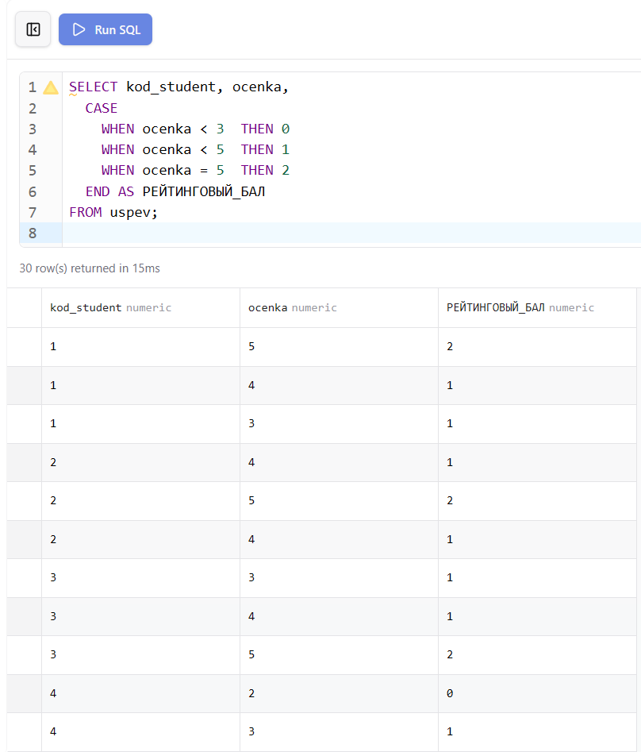
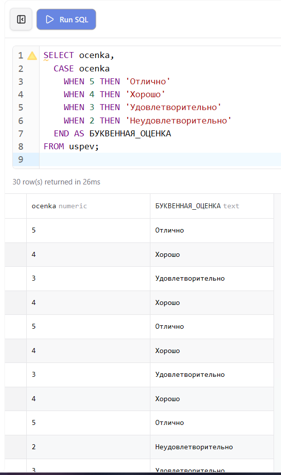
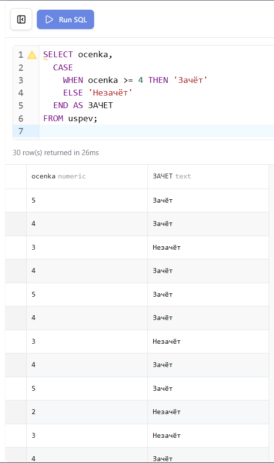
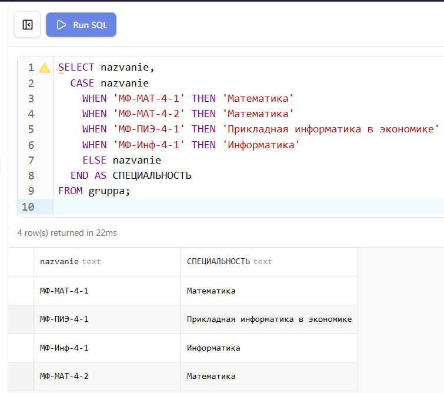
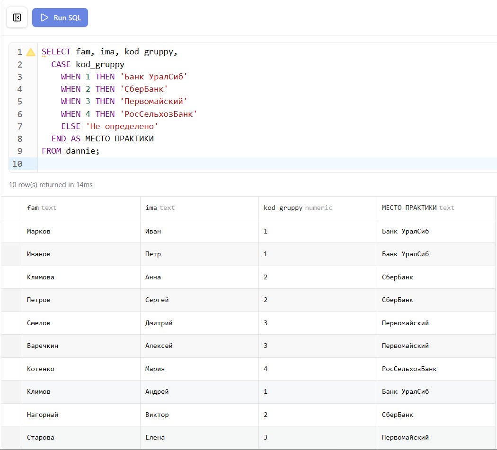

**Цель работы:** Научиться использовать оператор условного перехода `CASE` в двух формах: со значениями и с условиями поиска.

# 1. Настройка среды разработки (Docker Compose)

Лабораторная работа выполняется на базе данных `student`, запущенной в изолированном контейнере через файл `docker-compose.yml` в папке `lab-06`.

```yaml
services:
  db:
    image: mysql:8.0
    container_name: mysql-lab06
    restart: always
    command:
      [
        "mysqld",
        "--character-set-server=utf8mb4",
        "--collation-server=utf8mb4_unicode_ci",
      ]
    environment:
      MYSQL_ROOT_PASSWORD: secret
      MYSQL_DATABASE: lab
    ports:
      - "3312:3306"
    volumes:
      - lab06-data:/var/lib/mysql
      - ../student-init.sql:/docker-entrypoint-initdb.d/init.sql
    networks:
      - shared
```

`ports: "3312:3306"` — уникальный порт хоста для лабораторной №6, исключающий конфликты при одновременном запуске нескольких лабораторных работ.

`volumes: ../student-init.sql` — монтирует общий файл схемы базы данных из корня проекта. Все лабораторные работы с №2 по №11 используют одну и ту же схему `student`.

# 2. Теоретические сведения

Оператор `CASE` в языке SQL выполняет роль условного перехода и существует в двух формах.

Первая форма — `CASE` со значением — сравнивает проверяемое выражение с набором конкретных значений:

```sql
CASE проверяемое_значение
  WHEN значение1 THEN результат1
  WHEN значение2 THEN результат2
  ELSE результатX
END
```

Вторая форма — `CASE` с условием поиска — проверяет произвольные логические выражения для каждой строки:

```sql
CASE
  WHEN условие1 THEN результат1
  WHEN условие2 THEN результат2
  ELSE результатX
END
```

Ключевое слово `ELSE` необязательно — если оно отсутствует и ни одно условие не выполнено, возвращается `NULL`. Оператор `CASE` завершается ключевым словом `END` и может использоваться с псевдонимом `AS`.

# 3. Выполнение заданий

## Задание 1. Перевести каждую оценку в рейтинговый балл

За оценку меньше 3 начисляется 0 баллов, от 3 до 4 — 1 балл, за оценку 5 — 2 балла. Используется форма `CASE` с условиями поиска, поскольку границы диапазонов задаются логическими выражениями, а не точными значениями.

```sql
SELECT kod_student, ocenka,
  CASE
    WHEN ocenka < 3  THEN 0
    WHEN ocenka < 5  THEN 1
    WHEN ocenka = 5  THEN 2
  END AS РЕЙТИНГОВЫЙ_БАЛ
FROM uspev;
```

{ width=80% }

## Задание 2. Вывести список оценок и их буквенное обозначение

5 — «отлично», 4 — «хорошо», 3 — «удовлетворительно», 2 — «неудовлетворительно». Используется форма `CASE` со значением, поскольку сравниваются точные числовые значения оценок.

```sql
SELECT ocenka,
  CASE ocenka
    WHEN 5 THEN 'Отлично'
    WHEN 4 THEN 'Хорошо'
    WHEN 3 THEN 'Удовлетворительно'
    WHEN 2 THEN 'Неудовлетворительно'
  END AS БУКВЕННАЯ_ОЦЕНКА
FROM uspev;
```

{ width=80% }

## Задание 3. Вывести список оценок по системе «зачёт-незачёт»

Оценки 4 и 5 — «зачёт», остальные — «незачёт». Поскольку условие охватывает диапазон значений, применяется форма `CASE` с условиями поиска.

```sql
SELECT ocenka,
  CASE
    WHEN ocenka >= 4 THEN 'Зачёт'
    ELSE 'Незачёт'
  END AS ЗАЧЕТ
FROM uspev;
```

{ width=80% }

## Задание 4. Вывести названия групп и названия специальностей

«МФ-МАТ» — Математика, «МФ-ПИЭ» — Прикладная информатика в экономике, «МФ-Инф» — Информатика. В случае другого обозначения повторяется название группы. Используется форма `CASE` со значением, сравнивающая точные строковые значения.

```sql
SELECT nazvanie,
  CASE nazvanie
    WHEN 'МФ-МАТ-4-1' THEN 'Математика'
    WHEN 'МФ-МАТ-4-2' THEN 'Математика'
    WHEN 'МФ-ПИЭ-4-1' THEN 'Прикладная информатика в экономике'
    WHEN 'МФ-Инф-4-1' THEN 'Информатика'
    ELSE nazvanie
  END AS СПЕЦИАЛЬНОСТЬ
FROM gruppa;
```

{ width=80% }

## Задание 5. Вывести фамилии студентов и место прохождения практики

Студенты группы с кодом 1 проходят практику в «Банк УралСиб», с кодом 2 — «СберБанк», с кодом 3 — «Первомайский», с кодом 4 — «РосСельхозБанк». Используется форма `CASE` со значением по полю `kod_gruppy`.

```sql
SELECT fam, ima, kod_gruppy,
  CASE kod_gruppy
    WHEN 1 THEN 'Банк УралСиб'
    WHEN 2 THEN 'СберБанк'
    WHEN 3 THEN 'Первомайский'
    WHEN 4 THEN 'РосСельхозБанк'
    ELSE 'Не определено'
  END AS МЕСТО_ПРАКТИКИ
FROM dannie;
```

{ width=80% }

# 4. Проверка результатов

После запуска базы данных командой `docker compose up -d` из папки `lab-06` все таблицы создаются и заполняются автоматически из общего файла `student-init.sql`. Корректность структуры и данных проверяется через Prisma Studio и phpMyAdmin.

Prisma Studio отображает все таблицы с данными и позволяет визуально проверить структуру базы и связи между таблицами.

{ width=80% }

phpMyAdmin предоставляет возможность выполнять SQL-запросы напрямую и просматривать результаты в табличном виде.

{ width=80% }

Диаграмма связей в Prisma Studio наглядно показывает отношения между всеми таблицами базы данных `student`.

{ width=80% }

# 5. Вывод

В ходе лабораторной работы освоено применение оператора `CASE` в двух формах: со значением для сравнения с конкретными значениями и с условием поиска для проверки произвольных логических выражений. Изучено использование `CASE` для перевода числовых кодов в текстовые описания, реализации рейтинговых систем и условной классификации данных непосредственно в SQL-запросах.
