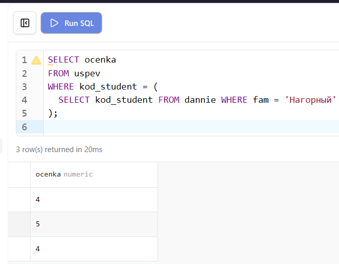
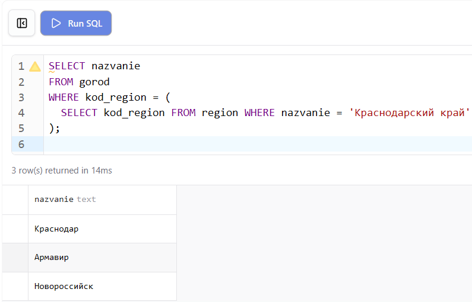
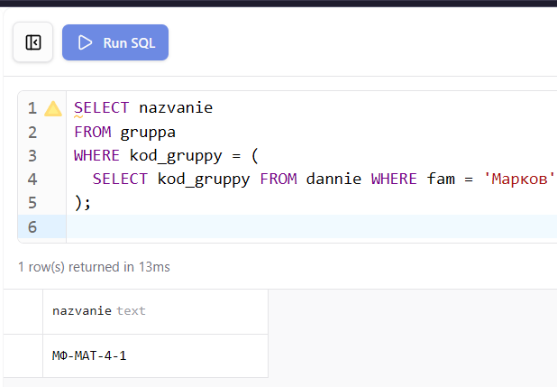
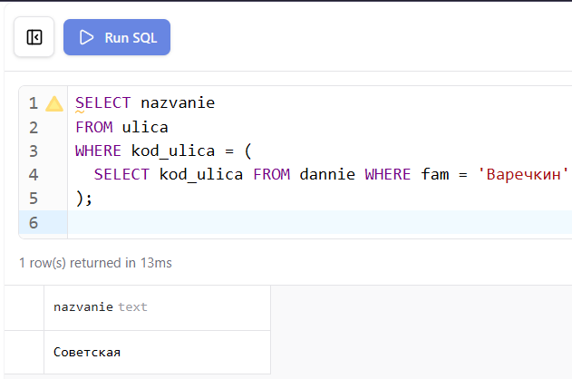
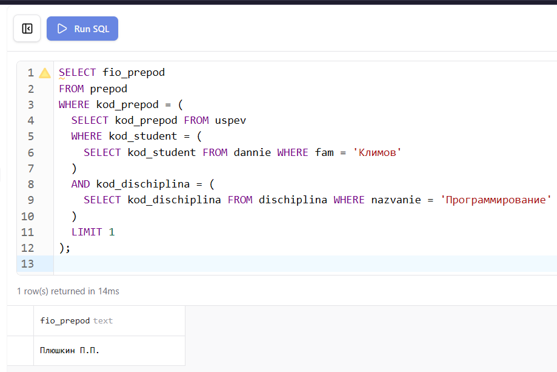
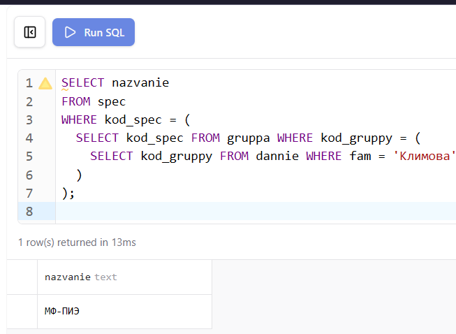
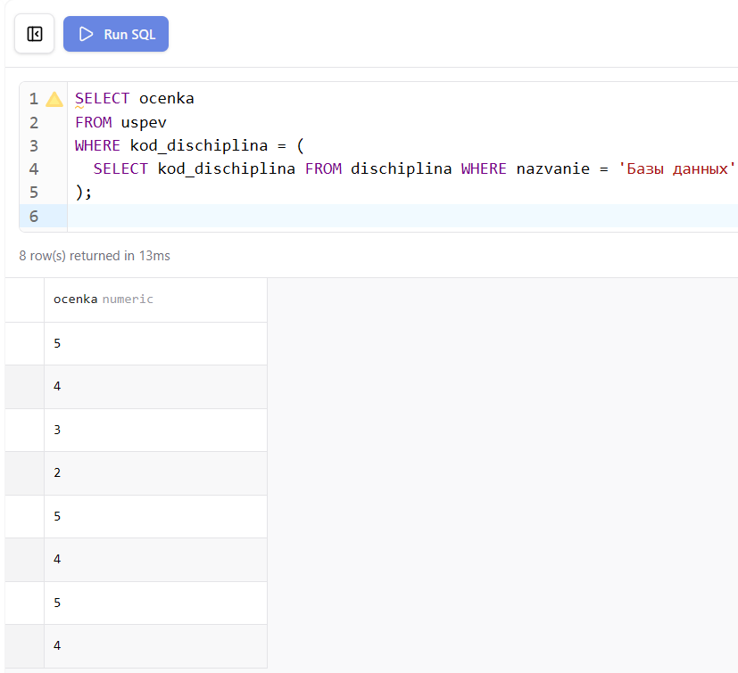
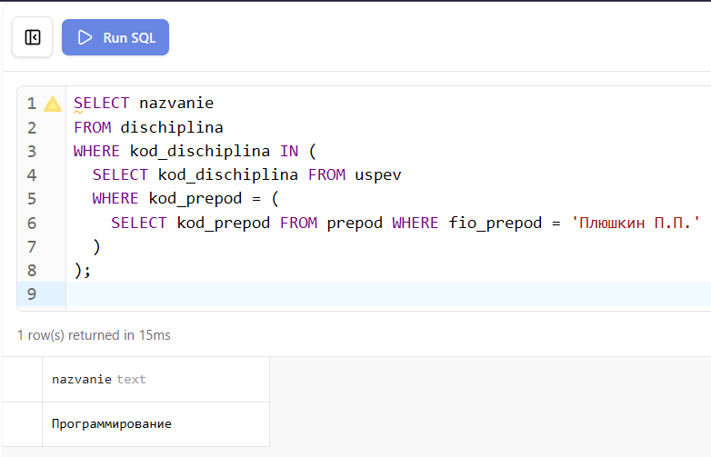
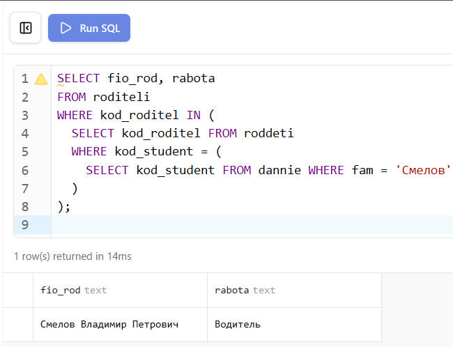
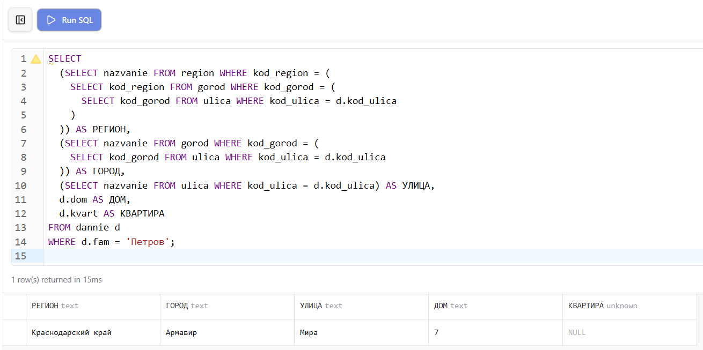

**Цель работы:** Научиться создавать простые подзапросы трёх видов: возвращающие единственное значение, список значений из одного столбца и набор записей.

# 1. Настройка среды разработки (Docker Compose)

Лабораторная работа выполняется на базе данных `student`, запущенной в изолированном контейнере через файл `docker-compose.yml` в папке `lab-07`.

```yaml
services:
  db:
    image: mysql:8.0
    container_name: mysql-lab07
    restart: always
    command:
      [
        "mysqld",
        "--character-set-server=utf8mb4",
        "--collation-server=utf8mb4_unicode_ci",
      ]
    environment:
      MYSQL_ROOT_PASSWORD: secret
      MYSQL_DATABASE: lab
    ports:
      - "3313:3306"
    volumes:
      - lab07-data:/var/lib/mysql
      - ../student-init.sql:/docker-entrypoint-initdb.d/init.sql
    networks:
      - shared
```

`ports: "3313:3306"` — уникальный порт хоста для лабораторной №7, исключающий конфликты при одновременном запуске нескольких лабораторных работ.

`volumes: ../student-init.sql` — монтирует общий файл схемы базы данных из корня проекта. Все лабораторные работы с №2 по №11 используют одну и ту же схему `student`.

# 2. Теоретические сведения

Подзапрос — это запрос на выборку данных, вложенный внутрь другого запроса. Внутренний подзапрос выполняется первым, и его результат передаётся внешнему запросу. Простые подзапросы формально не связаны с внешним запросом — они выполняются один раз независимо от него.

Существуют три вида простых подзапросов. Подзапросы, возвращающие единственное значение, используются в условиях сравнения с операторами `=`, `>`, `<` и подобными. Подзапросы, возвращающие список значений из одного столбца, применяются совместно с операторами `IN` и `NOT IN`. Подзапросы, возвращающие набор записей, используются в конструкции `FROM` как временная таблица или в `EXISTS`.

# 3. Выполнение заданий

## Задание 1. Вывести список оценок, которые получил студент Воркин

Подзапрос возвращает код студента по фамилии, внешний запрос использует это значение для выборки оценок. Поскольку подзапрос возвращает единственное значение, используется оператор `=`.

```sql
SELECT ocenka
FROM uspev
WHERE kod_student = (
  SELECT kod_student FROM dannie WHERE fam = 'Нагорный'
);
```

{ width=80% }

## Задание 2. Вывести все города Краснодарского края

Подзапрос возвращает код региона по его названию, внешний запрос выбирает все города с этим кодом.

```sql
SELECT nazvanie
FROM gorod
WHERE kod_region = (
  SELECT kod_region FROM region WHERE nazvanie = 'Краснодарский край'
);
```

{ width=100% }

## Задание 3. Вывести название группы студента Маркова

```sql
SELECT nazvanie
FROM gruppa
WHERE kod_gruppy = (
  SELECT kod_gruppy FROM dannie WHERE fam = 'Марков'
);
```

{ width=80% }

## Задание 4. Вывести название улицы, на которой живёт студент Варечкин

```sql
SELECT nazvanie
FROM ulica
WHERE kod_ulica = (
  SELECT kod_ulica FROM dannie WHERE fam = 'Варечкин'
);
```

{ width=80% }

## Задание 5. Определить фамилию преподавателя, поставившего студенту Климову оценку по программированию

Задача требует двух вложенных подзапросов: первый находит код студента Климова, второй — код дисциплины «Программирование». Внешний запрос находит преподавателя по обоим кодам через таблицу успеваемости.

```sql
SELECT fio_prepod
FROM prepod
WHERE kod_prepod = (
  SELECT kod_prepod FROM uspev
  WHERE kod_student = (
    SELECT kod_student FROM dannie WHERE fam = 'Климов'
  )
  AND kod_dischiplina = (
    SELECT kod_dischiplina FROM dischiplina WHERE nazvanie = 'Программирование'
  )
  LIMIT 1
);
```

{ width=100% }

## Задание 6. Определить специальность, на которой обучается Климова

```sql
SELECT nazvanie
FROM spec
WHERE kod_spec = (
  SELECT kod_spec FROM gruppa WHERE kod_gruppy = (
    SELECT kod_gruppy FROM dannie WHERE fam = 'Климова'
  )
);
```

{ width=100% }

## Задание 7. Какие оценки были получены по дисциплине «Базы данных»

Подзапрос возвращает единственное значение — код дисциплины. Внешний запрос выбирает все оценки с этим кодом.

```sql
SELECT ocenka
FROM uspev
WHERE kod_dischiplina = (
  SELECT kod_dischiplina FROM dischiplina WHERE nazvanie = 'Базы данных'
);
```

{ width=80% }

## Задание 8. Найти дисциплины, по которым оценки ставил преподаватель Плюшкин

Подзапрос возвращает список значений — коды дисциплин из таблицы успеваемости для конкретного преподавателя. Внешний запрос использует `IN` для выборки названий этих дисциплин.

```sql
SELECT nazvanie
FROM dischiplina
WHERE kod_dischiplina IN (
  SELECT kod_dischiplina FROM uspev
  WHERE kod_prepod = (
    SELECT kod_prepod FROM prepod WHERE fio_prepod = 'Плюшкин П.П.'
  )
);
```

{ width=80% }

## Задание 9. Определить где работают родители Смелова и вывести полный адрес студента Петрова

Запрос состоит из двух частей. Первая часть находит место работы родителей Смелова через связующую таблицу `roddeti`. Вторая часть собирает полный адрес Петрова, объединяя данные из таблиц `dannie`, `ulica`, `gorod` и `region` через последовательные подзапросы.

```sql
-- Место работы родителей Смелова
SELECT fio_rod, rabota
FROM roditeli
WHERE kod_roditel IN (
  SELECT kod_roditel FROM roddeti
  WHERE kod_student = (
    SELECT kod_student FROM dannie WHERE fam = 'Смелов'
  )
);
```

{ width=80% }

```sql
-- Полный адрес студента Петрова
SELECT
  (SELECT nazvanie FROM region WHERE kod_region = (
    SELECT kod_region FROM gorod WHERE kod_gorod = (
      SELECT kod_gorod FROM ulica WHERE kod_ulica = d.kod_ulica
    )
  )) AS РЕГИОН,
  (SELECT nazvanie FROM gorod WHERE kod_gorod = (
    SELECT kod_gorod FROM ulica WHERE kod_ulica = d.kod_ulica
  )) AS ГОРОД,
  (SELECT nazvanie FROM ulica WHERE kod_ulica = d.kod_ulica) AS УЛИЦА,
  d.dom AS ДОМ,
  d.kvart AS КВАРТИРА
FROM dannie d
WHERE d.fam = 'Петров';
```

{ width=100% }

```{=openxml}
<w:p><w:r><w:br w:type="page"/></w:r></w:p>
```

# 4. Проверка результатов

После запуска базы данных командой `docker compose up -d` из папки `lab-07` все таблицы создаются и заполняются автоматически из общего файла `student-init.sql`. Корректность структуры и данных проверяется через Prisma Studio и phpMyAdmin.

Prisma Studio отображает все таблицы с данными и позволяет визуально проверить структуру базы и связи между ними.

{ width=100% }

phpMyAdmin предоставляет возможность выполнять SQL-запросы напрямую и просматривать результаты в табличном виде.

{ width=100% }

Диаграмма связей в Prisma Studio наглядно показывает отношения между всеми таблицами базы данных `student`.

{ width=100% }

```{=openxml}
<w:p><w:r><w:br w:type="page"/></w:r></w:p>
```

## Вывод

В ходе лабораторной работы освоено создание простых подзапросов трёх видов: возвращающих единственное значение для использования с операторами сравнения, возвращающих список значений для применения с оператором `IN`, а также многоуровневых вложенных подзапросов для последовательного получения данных из нескольких связанных таблиц. Подзапросы позволяют формулировать сложные условия выборки без предварительного знания конкретных значений ключей.
