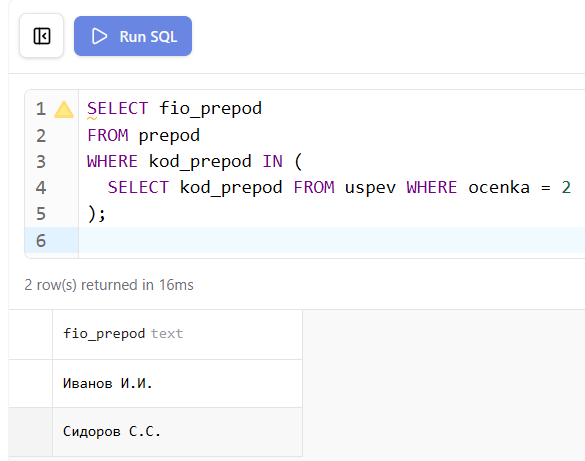
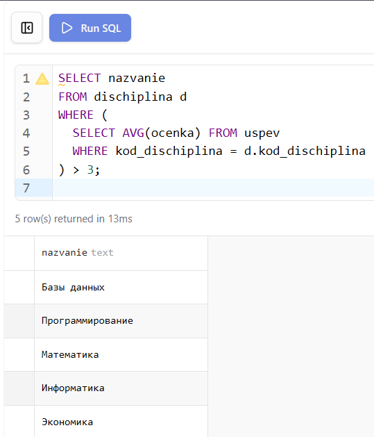
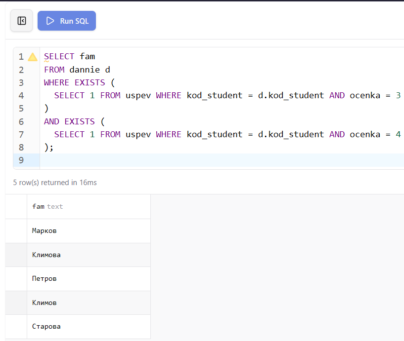
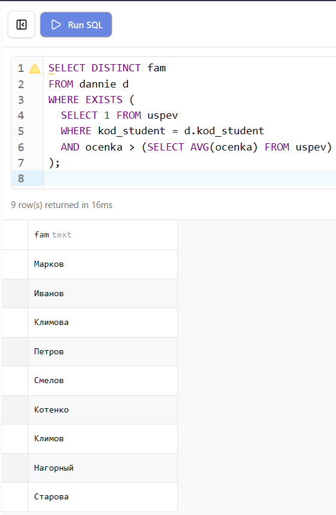
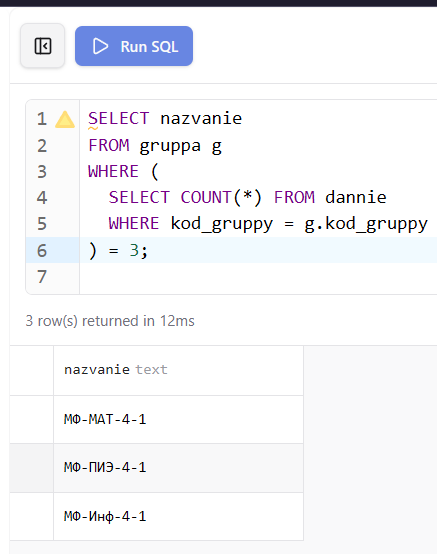

**Цель работы:** Научиться использовать связанные (соотнесённые, коррелированные) подзапросы, результат которых зависит от значений текущей строки внешнего запроса.

# 1. Настройка среды разработки (Docker Compose)

Лабораторная работа выполняется на базе данных `student`, запущенной в изолированном контейнере через файл `docker-compose.yml` в папке `lab-08`.

```yaml
services:
  db:
    image: mysql:8.0
    container_name: mysql-lab08
    restart: always
    command:
      [
        "mysqld",
        "--character-set-server=utf8mb4",
        "--collation-server=utf8mb4_unicode_ci",
      ]
    environment:
      MYSQL_ROOT_PASSWORD: secret
      MYSQL_DATABASE: lab
    ports:
      - "3314:3306"
    volumes:
      - lab08-data:/var/lib/mysql
      - ../student-init.sql:/docker-entrypoint-initdb.d/init.sql
    networks:
      - shared
```

`ports: "3314:3306"` — уникальный порт хоста для лабораторной №8, исключающий конфликты при одновременном запуске нескольких лабораторных работ.

`volumes: ../student-init.sql` — монтирует общий файл схемы базы данных из корня проекта. Все лабораторные работы с №2 по №11 используют одну и ту же схему `student`.

# 2. Теоретические сведения

Связанный (коррелированный) подзапрос отличается от простого тем, что его результат зависит от значения текущей строки внешнего запроса. Это означает, что внутренний подзапрос не может быть выполнен один раз и сохранён — он выполняется заново для каждой строки, обрабатываемой внешним запросом.

В связанном подзапросе используется ссылка на поле таблицы внешнего запроса через псевдоним. Например, если внешний запрос обращается к таблице `dischiplina` с псевдонимом `d`, то внутренний подзапрос может использовать `d.kod_dischiplina` для фильтрации строк таблицы `uspev` по текущей дисциплине. Концептуально система проверяет каждую строку внешней таблицы, выполняет для неё внутренний подзапрос и включает строку в результат только если условие истинно.

# 3. Выполнение заданий

## Задание 1. Вывести фамилии преподавателей, которые поставили хотя бы одну двойку

Для каждого преподавателя из таблицы `prepod` внутренний подзапрос проверяет, существует ли в таблице `uspev` хотя бы одна запись с оценкой 2 и совпадающим кодом преподавателя. Конструкция `IN` с подзапросом возвращает список кодов преподавателей, поставивших двойку.

```sql
SELECT fio_prepod
FROM prepod
WHERE kod_prepod IN (
  SELECT kod_prepod FROM uspev WHERE ocenka = 2
);
```

{ width=70% }

## Задание 2. Вывести названия предметов, средняя оценка по которым выше 3

Для каждой дисциплины из таблицы `dischiplina` внутренний подзапрос вычисляет среднюю оценку по этой дисциплине в таблице `uspev`, используя ссылку на `d.kod_dischiplina` из внешнего запроса. Строка включается в результат только если среднее значение превышает 3.

```sql
SELECT nazvanie
FROM dischiplina d
WHERE (
  SELECT AVG(ocenka) FROM uspev
  WHERE kod_dischiplina = d.kod_dischiplina
) > 3;
```

{ width=80% }

## Задание 3. Вывести фамилии студентов, у которых имеются оценки 3 и 4 одновременно

Используются два связанных подзапроса с `EXISTS`. Первый проверяет наличие тройки у студента, второй — наличие четвёрки. Оба условия должны выполняться одновременно через `AND`.

```sql
SELECT fam
FROM dannie d
WHERE EXISTS (
  SELECT 1 FROM uspev WHERE kod_student = d.kod_student AND ocenka = 3
)
AND EXISTS (
  SELECT 1 FROM uspev WHERE kod_student = d.kod_student AND ocenka = 4
);
```

{ width=80% }

## Задание 4. Вывести фамилии студентов, которые получили хотя бы одну оценку выше средней

Внутренний подзапрос вычисляет среднюю оценку по всей таблице `uspev`. Внешний подзапрос проверяет, есть ли у каждого студента хотя бы одна оценка, превышающая это среднее значение.

```sql
SELECT DISTINCT fam
FROM dannie d
WHERE EXISTS (
  SELECT 1 FROM uspev
  WHERE kod_student = d.kod_student
  AND ocenka > (SELECT AVG(ocenka) FROM uspev)
);
```

{ width=80% }

## Задание 5. Вывести названия групп, в которых обучается 6 студентов

Для каждой группы из таблицы `gruppa` внутренний подзапрос подсчитывает количество студентов с совпадающим кодом группы в таблице `dannie`. Строка включается в результат только если это количество равно 3.

```sql
SELECT nazvanie
FROM gruppa g
WHERE (
  SELECT COUNT(*) FROM dannie
  WHERE kod_gruppy = g.kod_gruppy
) = 3;
```

{ width=80% }

```{=openxml}
<w:p><w:r><w:br w:type="page"/></w:r></w:p>
```

# 4. Проверка результатов

После запуска базы данных командой `docker compose up -d` из папки `lab-08` все таблицы создаются и заполняются автоматически из общего файла `student-init.sql`. Корректность структуры и данных проверяется через Prisma Studio и phpMyAdmin.

Prisma Studio отображает все таблицы с данными и позволяет визуально проверить структуру базы и связи между ними.

{ width=80% }

phpMyAdmin предоставляет возможность выполнять SQL-запросы напрямую и просматривать результаты в табличном виде.

{ width=80% }

Диаграмма связей в Prisma Studio наглядно показывает отношения между всеми таблицами базы данных `student`.

{ width=80% }

## Вывод

В ходе лабораторной работы освоено создание связанных подзапросов, результат которых зависит от значения текущей строки внешнего запроса. Изучено использование конструкции `EXISTS` для проверки наличия строк, удовлетворяющих условию, а также применение ссылок на поля внешнего запроса через псевдонимы таблиц. В отличие от простых подзапросов, связанный подзапрос выполняется повторно для каждой строки внешнего запроса, что позволяет реализовывать условия, зависящие от контекста текущей обрабатываемой записи.
