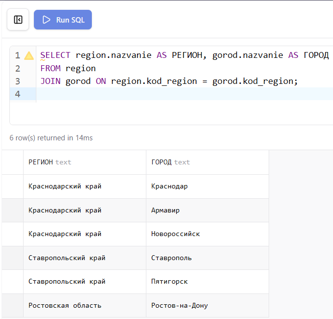
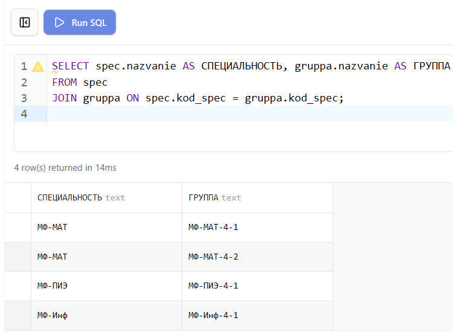
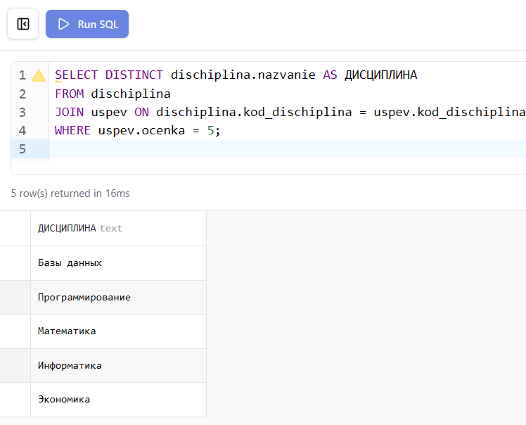
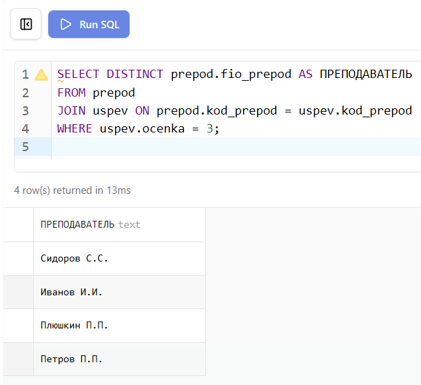
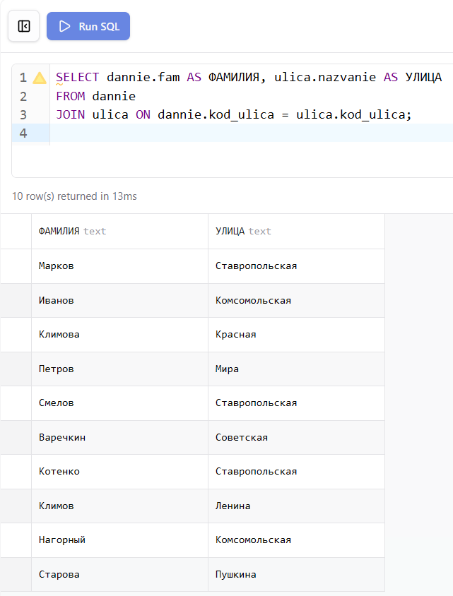
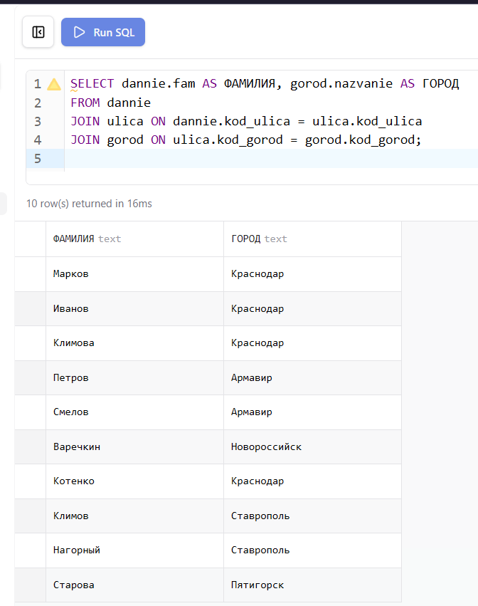
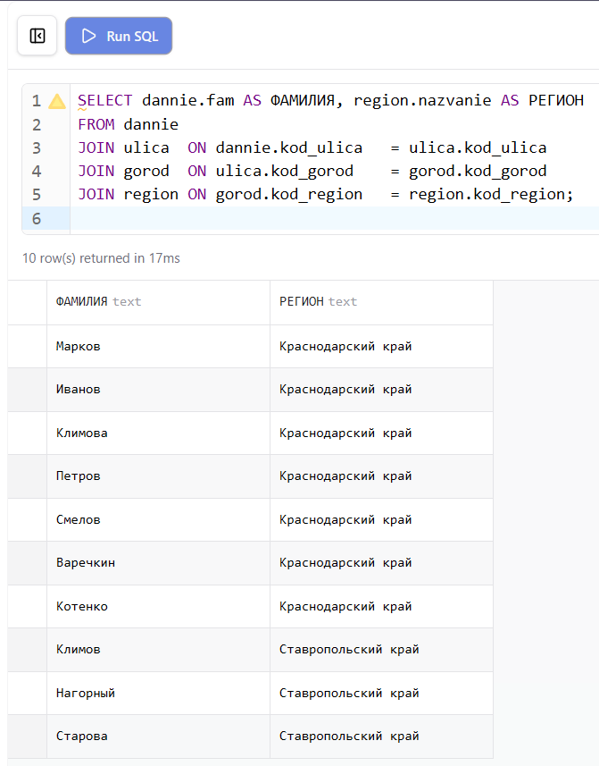
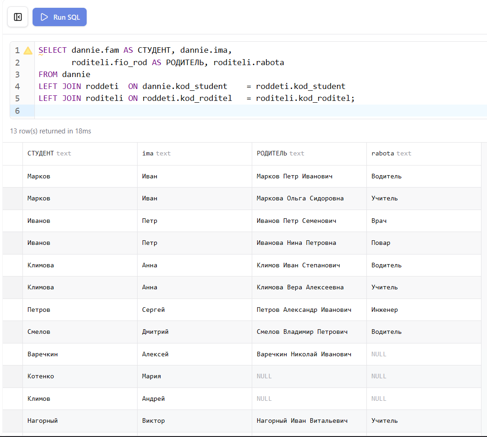

**Цель работы:** Научиться соединять таблицы различными способами: естественное соединение, условное соединение, соединение по именам столбцов, левое и правое внешние соединения.

# 1. Настройка среды разработки (Docker Compose)

Лабораторная работа выполняется на базе данных `student`, запущенной в изолированном контейнере через файл `docker-compose.yml` в папке `lab-09`.

```yaml
services:
  db:
    image: mysql:8.0
    container_name: mysql-lab09
    restart: always
    command:
      [
        "mysqld",
        "--character-set-server=utf8mb4",
        "--collation-server=utf8mb4_unicode_ci",
      ]
    environment:
      MYSQL_ROOT_PASSWORD: secret
      MYSQL_DATABASE: lab
    ports:
      - "3315:3306"
    volumes:
      - lab09-data:/var/lib/mysql
      - ../student-init.sql:/docker-entrypoint-initdb.d/init.sql
    networks:
      - shared
```

`ports: "3315:3306"` — уникальный порт хоста для лабораторной №9, исключающий конфликты при одновременном запуске нескольких лабораторных работ.

`volumes: ../student-init.sql` — монтирует общий файл схемы базы данных из корня проекта. Все лабораторные работы с №2 по №11 используют одну и ту же схему `student`.

# 2. Теоретические сведения

Операции соединения позволяют объединять строки из двух и более таблиц в одном результирующем наборе. Декартово произведение двух таблиц содержит все возможные комбинации их строк — именно из него отбираются нужные записи с помощью условия соединения.

Внутреннее соединение `INNER JOIN` (или просто `JOIN`) возвращает только те строки, для которых в обеих таблицах найдено совпадение. `NATURAL JOIN` автоматически соединяет таблицы по всем одноимённым столбцам. `JOIN ... ON` позволяет задать произвольное условие соединения. `JOIN ... USING` указывает конкретные одноимённые столбцы для соединения.

Внешние соединения сохраняют несовпадающие строки. `LEFT JOIN` сохраняет все строки левой таблицы, заполняя недостающие значения из правой таблицы значением `NULL`. `RIGHT JOIN` работает симметрично — сохраняет все строки правой таблицы. `FULL JOIN` объединяет оба внешних соединения, однако MySQL не поддерживает его напрямую.

# 3. Выполнение заданий

## Задание 1. Вывести названия регионов и соответствующие названия городов

Условное соединение `JOIN ... ON` связывает таблицы `region` и `gorod` по полю `kod_region`. В результат попадают только те города, для которых существует соответствующий регион.

```sql
SELECT region.nazvanie AS РЕГИОН, gorod.nazvanie AS ГОРОД
FROM region
JOIN gorod ON region.kod_region = gorod.kod_region;
```

{ width=100% }

## Задание 2. Вывести перечень специальностей и названия групп

```sql
SELECT spec.nazvanie AS СПЕЦИАЛЬНОСТЬ, gruppa.nazvanie AS ГРУППА
FROM spec
JOIN gruppa ON spec.kod_spec = gruppa.kod_spec;
```

{ width=100% }

## Задание 3. Вывести названия дисциплин, по которым студенты получили 5

Соединение трёх таблиц выполняется последовательно: сначала `dischiplina` соединяется с `uspev` по коду дисциплины, затем применяется фильтр по оценке. Ключевое слово `DISTINCT` исключает повторяющиеся названия дисциплин.

```sql
SELECT DISTINCT dischiplina.nazvanie AS ДИСЦИПЛИНА
FROM dischiplina
JOIN uspev ON dischiplina.kod_dischiplina = uspev.kod_dischiplina
WHERE uspev.ocenka = 5;
```

{ width=100% }

## Задание 4. Вывести фамилии преподавателей, поставивших 3

```sql
SELECT DISTINCT prepod.fio_prepod AS ПРЕПОДАВАТЕЛЬ
FROM prepod
JOIN uspev ON prepod.kod_prepod = uspev.kod_prepod
WHERE uspev.ocenka = 3;
```

{ width=100% }

## Задание 5. Вывести фамилии студентов и названия соответствующих улиц

```sql
SELECT dannie.fam AS ФАМИЛИЯ, ulica.nazvanie AS УЛИЦА
FROM dannie
JOIN ulica ON dannie.kod_ulica = ulica.kod_ulica;
```

{ width=80% }

## Задание 6. Вывести фамилии студентов и названия соответствующих городов

Для получения города необходимо пройти через таблицу `ulica`, поскольку в таблице `dannie` хранится только код улицы, а не города напрямую.

```sql
SELECT dannie.fam AS ФАМИЛИЯ, gorod.nazvanie AS ГОРОД
FROM dannie
JOIN ulica ON dannie.kod_ulica = ulica.kod_ulica
JOIN gorod ON ulica.kod_gorod = gorod.kod_gorod;
```

{ width=80% }

## Задание 7. Вывести фамилии студентов и названия соответствующих регионов

Цепочка соединений продолжается: от студента через улицу и город до региона.

```sql
SELECT dannie.fam AS ФАМИЛИЯ, region.nazvanie AS РЕГИОН
FROM dannie
JOIN ulica  ON dannie.kod_ulica   = ulica.kod_ulica
JOIN gorod  ON ulica.kod_gorod    = gorod.kod_gorod
JOIN region ON gorod.kod_region   = region.kod_region;
```

{ width=80% }

## Задание 8. Вывести информацию о студентах и их родителях

Связь между студентами и родителями реализована через промежуточную таблицу `roddeti`. Для получения полной информации выполняется последовательное соединение трёх таблиц. Используется `LEFT JOIN` чтобы сохранить в результате студентов, у которых родители не указаны в базе.

```sql
SELECT dannie.fam AS СТУДЕНТ, dannie.ima,
       roditeli.fio_rod AS РОДИТЕЛЬ, roditeli.rabota
FROM dannie
LEFT JOIN roddeti  ON dannie.kod_student    = roddeti.kod_student
LEFT JOIN roditeli ON roddeti.kod_roditel   = roditeli.kod_roditel;
```

{ width=100% }

# 4. Проверка результатов

После запуска базы данных командой `docker compose up -d` из папки `lab-09` все таблицы создаются и заполняются автоматически из общего файла `student-init.sql`. Корректность структуры и данных проверяется через Prisma Studio и phpMyAdmin.

Prisma Studio отображает все таблицы с данными и позволяет визуально проверить структуру базы и связи между ними.

{ width=80% }

phpMyAdmin предоставляет возможность выполнять SQL-запросы напрямую и просматривать результаты в табличном виде.

{ width=80% }

Диаграмма связей в Prisma Studio наглядно показывает отношения между всеми таблицами базы данных `student`.

{ width=80% }

## Вывод

В ходе лабораторной работы освоены основные виды операций соединения таблиц в MySQL. Изучены внутренние соединения `JOIN ... ON` для объединения таблиц по явно заданному условию, а также построение цепочек из нескольких последовательных соединений для получения данных из связанных таблиц. Применение `LEFT JOIN` позволило сохранить в результате записи, не имеющие соответствия в присоединяемой таблице, что важно при работе с необязательными связями между сущностями.
