**Цель работы:** Научиться создавать запросы на добавление, удаление и изменение данных в таблицах базы данных с использованием операторов `INSERT`, `DELETE` и `UPDATE`.

# 1. Настройка среды разработки (Docker Compose)

Лабораторная работа выполняется на базе данных `student`, запущенной в изолированном контейнере через файл `docker-compose.yml` в папке `lab-10`.

```yaml
services:
  db:
    image: mysql:8.0
    container_name: mysql-lab10
    restart: always
    command:
      [
        "mysqld",
        "--character-set-server=utf8mb4",
        "--collation-server=utf8mb4_unicode_ci",
      ]
    environment:
      MYSQL_ROOT_PASSWORD: secret
      MYSQL_DATABASE: lab
    ports:
      - "3316:3306"
    volumes:
      - lab10-data:/var/lib/mysql
      - ../student-init.sql:/docker-entrypoint-initdb.d/init.sql
    networks:
      - shared
```

`ports: "3316:3306"` — уникальный порт хоста для лабораторной №10, исключающий конфликты при одновременном запуске нескольких лабораторных работ.

`volumes: ../student-init.sql` — монтирует общий файл схемы базы данных из корня проекта. Все лабораторные работы с №2 по №11 используют одну и ту же схему `student`.

# 2. Теоретические сведения

Оператор `INSERT` добавляет новые записи в таблицу. Существует несколько форм: с перечислением всех значений через `VALUES`, с указанием конкретных столбцов и соответствующих значений, а также с вставкой результатов подзапроса `SELECT`. Можно добавлять несколько записей за один запрос, перечисляя наборы значений через запятую.

Оператор `DELETE` удаляет записи из таблицы, удовлетворяющие условию `WHERE`. Операция необратима, поэтому перед удалением рекомендуется выполнить `SELECT` с тем же условием для проверки. Без условия `WHERE` удаляются все записи таблицы, при этом сама таблица сохраняется.

Оператор `UPDATE` изменяет значения указанных столбцов в строках, удовлетворяющих условию `WHERE`. В условии может использоваться подзапрос на выборку данных.

# 3. Выполнение заданий

## Задание 1. Добавить в таблицу о студентах одного студента

Форма `INSERT` с перечислением столбцов позволяет указать только нужные поля — остальные получат значение `NULL` или значение по умолчанию. Это более надёжный способ, чем перечисление всех значений подряд.

```sql
INSERT INTO dannie (fam, ima, otch, date_rognen, telephone, dom, kvart, kod_gruppy, kod_ulica)
VALUES ('Воркин', 'Фома', 'Григорьевич', '1991-05-10', '89181112233', '3', '15', 1, 2);
```

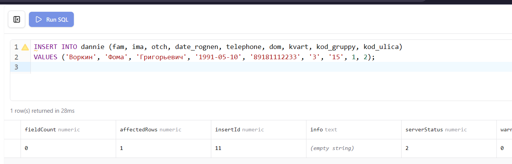{ width=100% }

## Задание 2. Добавить в таблицу о родителях информацию о двух родителях студента

Несколько записей добавляются за один запрос путём перечисления нескольких наборов значений в скобках через запятую после `VALUES`.

```sql
INSERT INTO roditeli (fio_rod, rabota, tel) VALUES
('Воркин Григорий Иванович',  'Инженер', '89182223344'),
('Воркина Мария Петровна',    'Учитель', '89283334455');
```

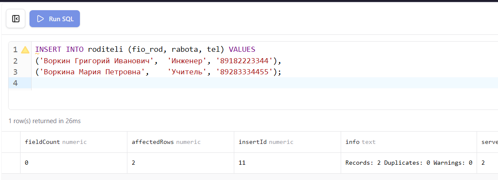{ width=100% }

## Задание 3. Названия улиц добавить в названия городов

Форма `INSERT ... SELECT` вставляет в таблицу записи, возвращённые запросом на выборку. Столбцы результата подзапроса должны соответствовать по типу и порядку столбцам в списке вставки.

```sql
INSERT INTO gorod (nazvanie, kod_region)
SELECT nazvanie, 1 FROM ulica;
```

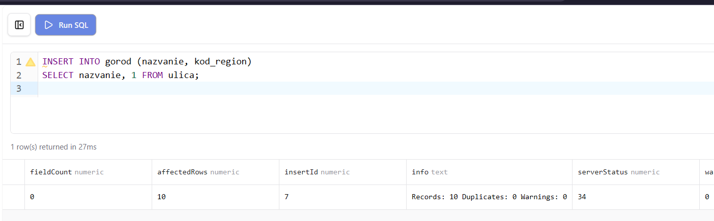{ width=100% }

## Задание 4. Добавить названия дисциплин в названия специальностей

```sql
INSERT INTO spec (nazvanie)
SELECT nazvanie FROM dischiplina;
```

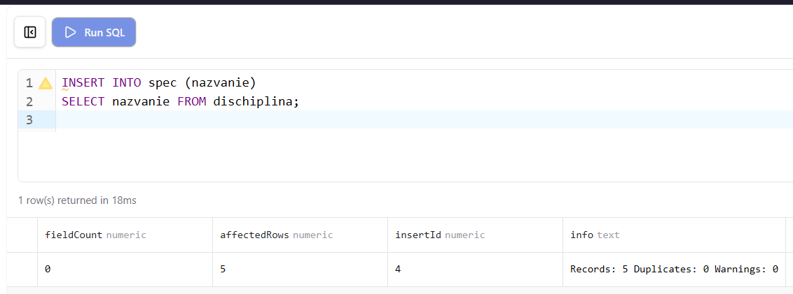{ width=100% }

## Задание 5. Удалить из таблицы города названия улиц

Сначала выполняется проверочный `SELECT` для просмотра записей, которые будут удалены. Затем выполняется `DELETE` с тем же условием. Поскольку мы добавляли названия улиц в таблицу `gorod` в задании 3, удаляем их по совпадению с названиями из таблицы `ulica`.

```sql
-- Проверка перед удалением
SELECT * FROM gorod
WHERE nazvanie IN (SELECT nazvanie FROM ulica);

-- Удаление
DELETE FROM gorod
WHERE nazvanie IN (SELECT nazvanie FROM ulica);
```

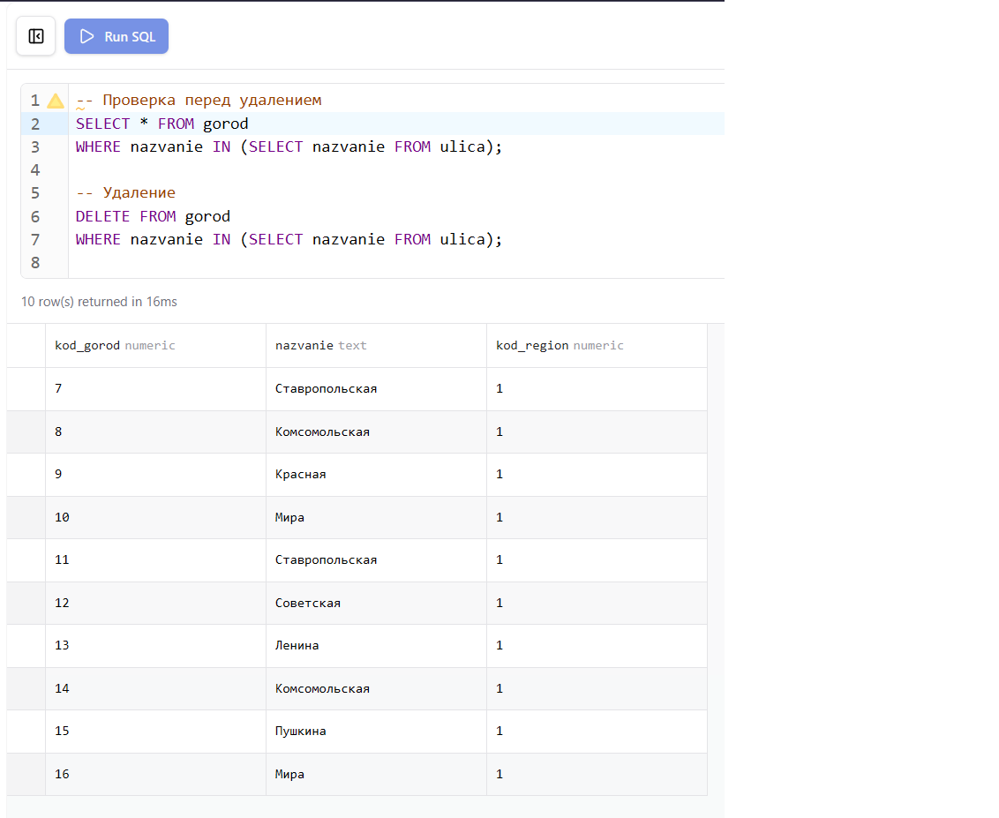{ width=100% }

## Задание 6. Удалить из таблицы специальности названия дисциплин

```sql
-- Проверка перед удалением
SELECT * FROM spec
WHERE nazvanie IN (SELECT nazvanie FROM dischiplina);

-- Удаление
DELETE FROM spec
WHERE nazvanie IN (SELECT nazvanie FROM dischiplina);
```

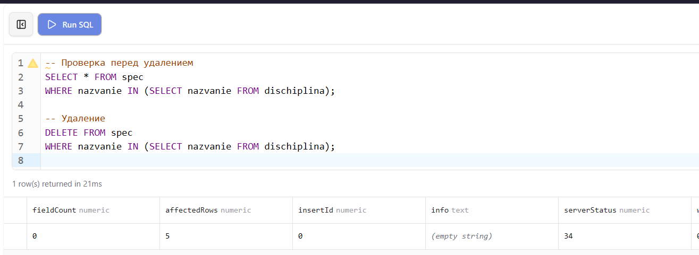{ width=100% }

## Задание 7. Удалить информацию о добавленном студенте

Удаление выполняется по фамилии добавленного в задании 1 студента. Благодаря внешнему ключу с `ON DELETE CASCADE` связанные записи в `roddeti` и `uspev` удалятся автоматически.

```sql
DELETE FROM dannie WHERE fam = 'Воркин' AND ima = 'Фома';
```

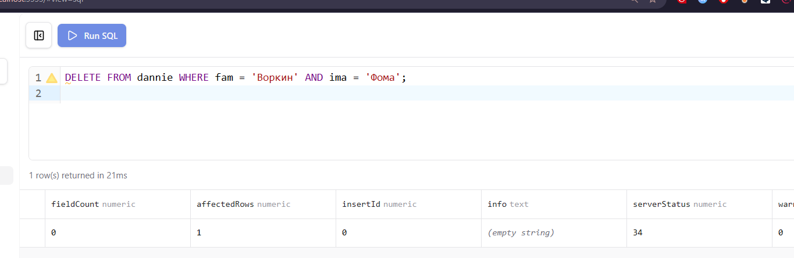{ width=100% }

## Задание 8. Удалить информацию о родителях добавленного студента

```sql
DELETE FROM roditeli
WHERE fio_rod IN ('Воркин Григорий Иванович', 'Воркина Мария Петровна');
```

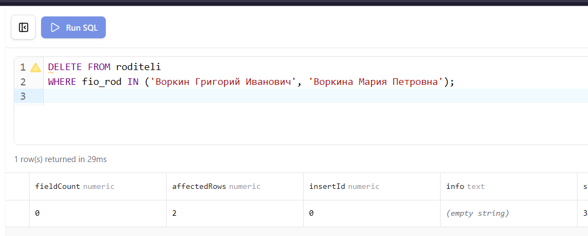{ width=100% }

## Задание 9. Изменить номера телефонов МТС на Мегафон (8918 на 8928)

Оператор `UPDATE` изменяет значения в указанных столбцах для всех строк, удовлетворяющих условию `WHERE`. Функция `REPLACE` заменяет часть строки без изменения остальных символов.

```sql
UPDATE roditeli
SET tel = REPLACE(tel, '8918', '8928')
WHERE tel LIKE '8918%';
```

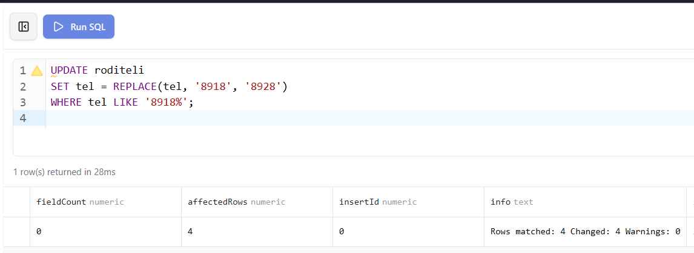{ width=100% }

## Задание 10. Изменить название дисциплины «Информатика» на «Информатика и ИТ»

```sql
UPDATE dischiplina
SET nazvanie = 'Информатика и ИТ'
WHERE nazvanie = 'Информатика';
```

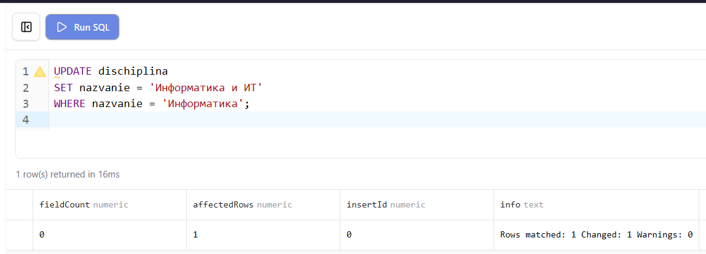{ width=100% }

## Задание 11. Воркин Фома Григорьевич перевёлся в группу с кодом 2

Поскольку студент Воркин был удалён в задании 7, для демонстрации операции `UPDATE` выполним перевод студента Маркова в группу с кодом 2. Это наглядно показывает синтаксис изменения внешнего ключа.

```sql
UPDATE dannie
SET kod_gruppy = 2
WHERE fam = 'Марков' AND ima = 'Иван';
```

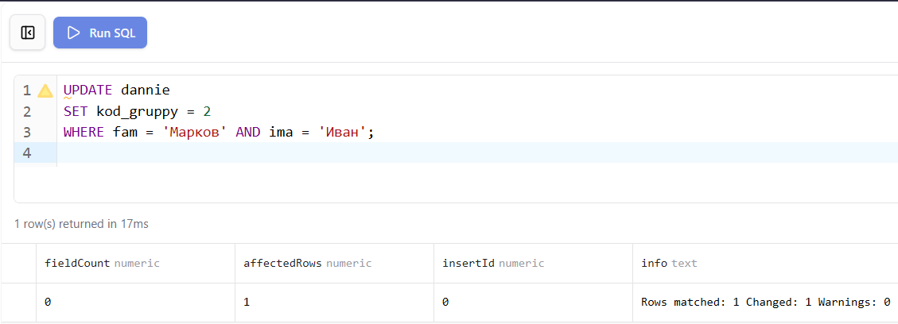{ width=100% }

# 4. Проверка результатов

После запуска базы данных командой `docker compose up -d` из папки `lab-10` все таблицы создаются и заполняются автоматически из общего файла `student-init.sql`. Корректность структуры и данных проверяется через Prisma Studio и phpMyAdmin.

Prisma Studio отображает все таблицы с данными и позволяет визуально проверить структуру базы и связи между ними.

{ width=80% }

phpMyAdmin предоставляет возможность выполнять SQL-запросы напрямую и просматривать результаты в табличном виде.

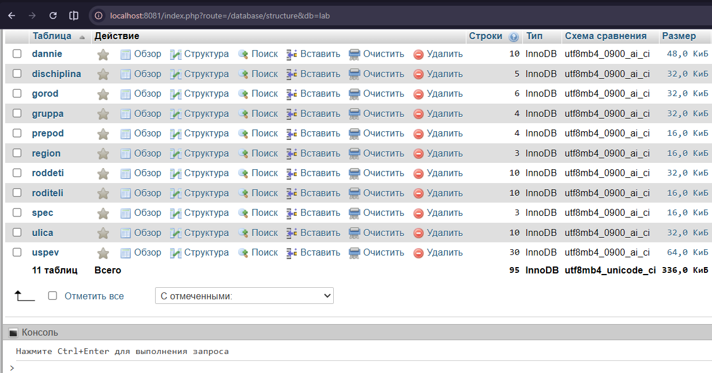{ width=80% }

Диаграмма связей в Prisma Studio наглядно показывает отношения между всеми таблицами базы данных `student`.

{ width=80% }

```{=openxml}
<w:p><w:r><w:br w:type="page"/></w:r></w:p>
```

## Вывод

В ходе лабораторной работы освоены операторы модификации данных в MySQL. Изучены различные формы оператора `INSERT`: с явным перечислением столбцов и значений, с вставкой нескольких записей за один запрос, а также с использованием результатов подзапроса `SELECT`. Отработано применение оператора `DELETE` с условием `WHERE` и подзапросом, а также оператора `UPDATE` для изменения значений полей в выбранных строках.
