**Цель работы:** Познакомиться с понятием представления; научиться создавать представления, выполнять запросы к ним и удалять их.

# 1. Настройка среды разработки (Docker Compose)

Лабораторная работа выполняется на базе данных `student`, запущенной в изолированном контейнере через файл `docker-compose.yml` в папке `lab-11`.

```yaml
services:
  db:
    image: mysql:8.0
    container_name: mysql-lab11
    restart: always
    command:
      [
        "mysqld",
        "--character-set-server=utf8mb4",
        "--collation-server=utf8mb4_unicode_ci",
      ]
    environment:
      MYSQL_ROOT_PASSWORD: secret
      MYSQL_DATABASE: lab
    ports:
      - "3317:3306"
    volumes:
      - lab11-data:/var/lib/mysql
      - ../student-init.sql:/docker-entrypoint-initdb.d/init.sql
    networks:
      - shared
```

`ports: "3317:3306"` — уникальный порт хоста для лабораторной №11, исключающий конфликты при одновременном запуске нескольких лабораторных работ.

`volumes: ../student-init.sql` — монтирует общий файл схемы базы данных из корня проекта. Все лабораторные работы с №2 по №11 используют одну и ту же схему `student`.

# 2. Теоретические сведения

Представление — это виртуальная таблица, основанная на результате SQL-запроса. Оно не хранит данные физически — при каждом обращении к представлению выполняется запрос, лежащий в его основе, и возвращается актуальный результат. Представления существуют в базе данных до явного удаления и доступны всем пользователям, имеющим соответствующие права.

Представления создаются оператором `CREATE VIEW`:

```sql
CREATE VIEW имя_представления AS запрос;
```

После создания к представлению можно обращаться как к обычной таблице — выполнять `SELECT` с условиями, сортировкой и агрегацией. Имена представлений не должны совпадать с именами таблиц. Удаление представления выполняется командой `DROP VIEW имя_представления`.

# 3. Выполнение заданий

## Задание 1. Создать представление DAN

Представление `DAN` выводит фамилию студента, его паспортные данные и название улицы проживания. Для получения названия улицы выполняется соединение таблиц `dannie` и `ulica` по полю `kod_ulica`.

```sql
CREATE VIEW DAN AS
SELECT d.fam, d.pasp_dannie, u.nazvanie AS ulica
FROM dannie d
JOIN ulica u ON d.kod_ulica = u.kod_ulica;
```

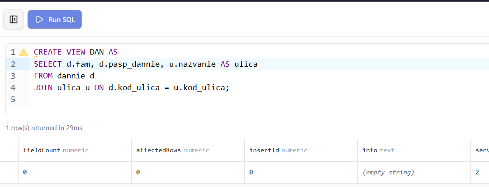{ width=100% }

## Задание 2. В представлении DAN отсортировать данные по улицам в алфавитном порядке

После создания представления к нему можно обращаться с любыми запросами, включая сортировку, точно так же как к обычной таблице.

```sql
SELECT * FROM DAN ORDER BY ulica ASC;
```

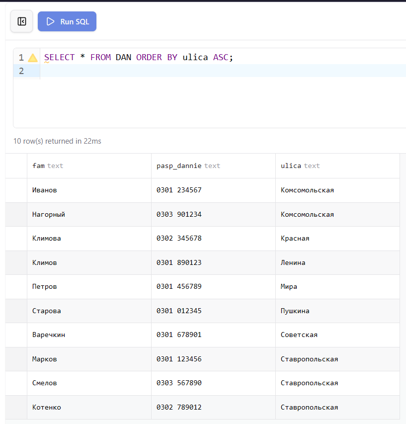{ width=100% }

## Задание 3. В представлении DAN вывести студентов проживающих на улицах начинающихся на букву К

```sql
SELECT * FROM DAN WHERE ulica LIKE 'К%';
```

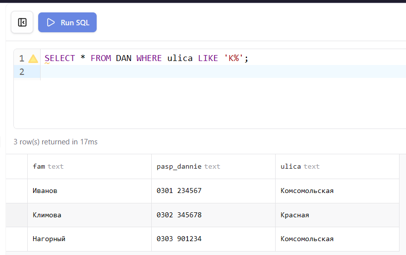{ width=80% }

## Задание 4. Создать представление MINMAX

Представление `MINMAX` выводит фамилию студента, его минимальную и максимальную оценку. Агрегатные функции применяются при группировке по коду студента, а фамилия получается через соединение с таблицей `dannie`.

```sql
CREATE VIEW MINMAX AS
SELECT d.fam,
  MIN(u.ocenka) AS min_ocenka,
  MAX(u.ocenka) AS max_ocenka
FROM dannie d
JOIN uspev u ON d.kod_student = u.kod_student
GROUP BY d.kod_student, d.fam;
```

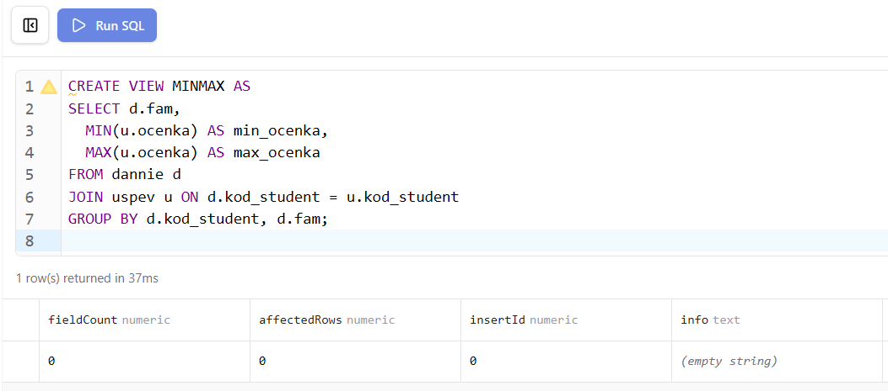{ width=90% }

## Задание 5. В представлении MINMAX найти среднее минимального и максимального значения оценок

```sql
SELECT AVG(min_ocenka) AS СРЕДНЕЕ_МИН,
       AVG(max_ocenka) AS СРЕДНЕЕ_МАКС
FROM MINMAX;
```

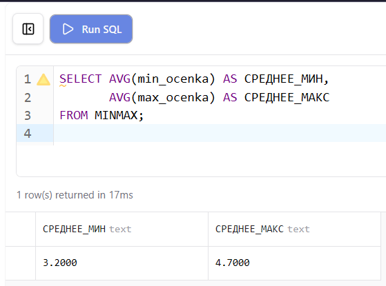{ width=100% }

## Задание 6. В представлении MINMAX найти среднее минимального и максимального значения оценок для каждого студента

```sql
SELECT fam,
  (min_ocenka + max_ocenka) / 2 AS СРЕДНЕЕ
FROM MINMAX;
```

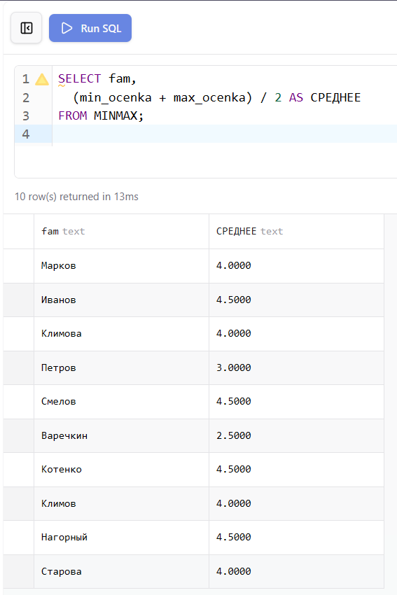{ width=80% }

## Задание 7. Создать представление OBUCH

Представление `OBUCH` включает фамилию студента, название группы и название специальности. Для получения всех трёх значений выполняется последовательное соединение таблиц `dannie`, `gruppa` и `spec`.

```sql
CREATE VIEW OBUCH AS
SELECT d.fam AS fio,
       g.nazvanie AS gruppa,
       s.nazvanie AS spec
FROM dannie d
JOIN gruppa g ON d.kod_gruppy = g.kod_gruppy
JOIN spec   s ON g.kod_spec   = s.kod_spec;
```

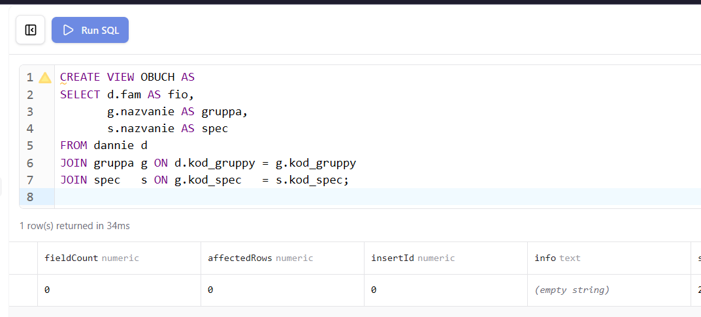{ width=100% }

## Задание 8. В представлении OBUCH подсчитать количество студентов в каждой группе

```sql
SELECT gruppa, COUNT(*) AS КОЛИЧЕСТВО_СТУДЕНТОВ
FROM OBUCH
GROUP BY gruppa;
```

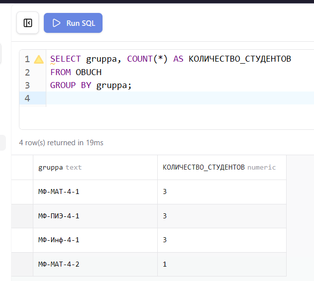{ width=80% }

## Задание 9. Создать представление ADRES

Представление `ADRES` содержит полный адрес студента: фамилию, регион, город, улицу, дом и квартиру. Для его построения выполняется цепочка соединений через четыре таблицы.

```sql
CREATE VIEW ADRES AS
SELECT d.fam AS fio,
       r.nazvanie AS region,
       g.nazvanie AS gorod,
       u.nazvanie AS ulica,
       d.dom,
       d.kvart
FROM dannie d
JOIN ulica  u ON d.kod_ulica   = u.kod_ulica
JOIN gorod  g ON u.kod_gorod   = g.kod_gorod
JOIN region r ON g.kod_region  = r.kod_region;
```

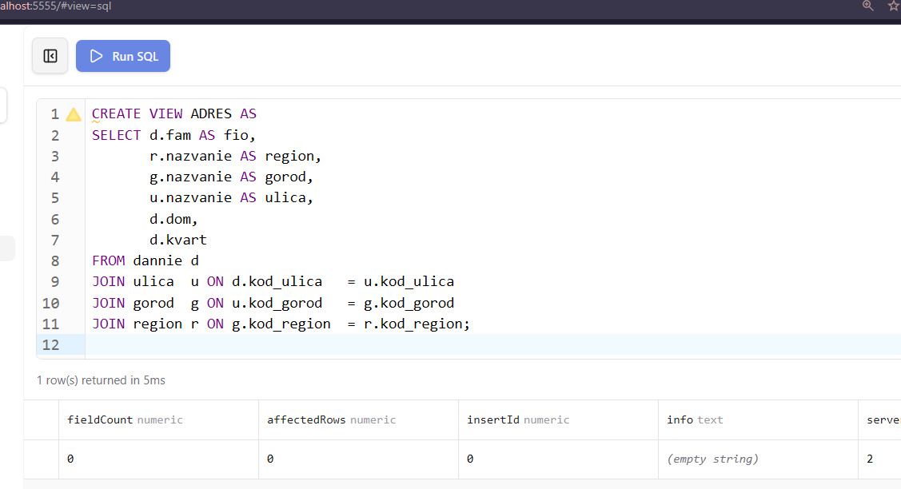{ width=100% }

## Задание 10. В представлении ADRES вывести студентов по городам и количество студентов в каждом городе

```sql
SELECT gorod, fio FROM ADRES ORDER BY gorod;

SELECT gorod, COUNT(*) AS КОЛИЧЕСТВО
FROM ADRES
GROUP BY gorod;
```

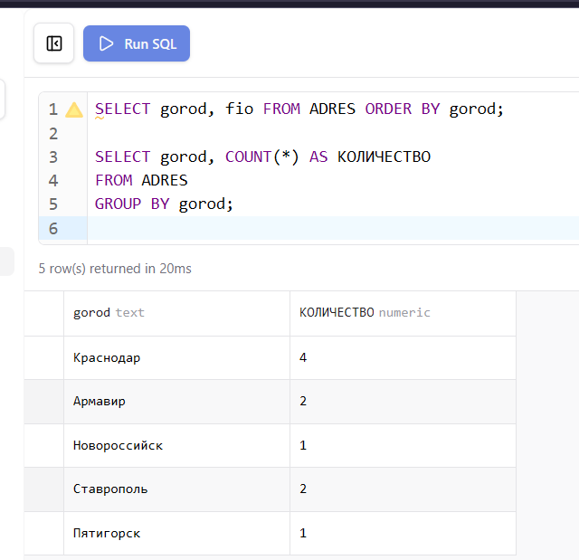{ width=80% }

## Задание 11. В представлении ADRES вывести студентов по регионам и количество студентов в каждом регионе

```sql
SELECT region, fio FROM ADRES ORDER BY region;

SELECT region, COUNT(*) AS КОЛИЧЕСТВО
FROM ADRES
GROUP BY region;
```

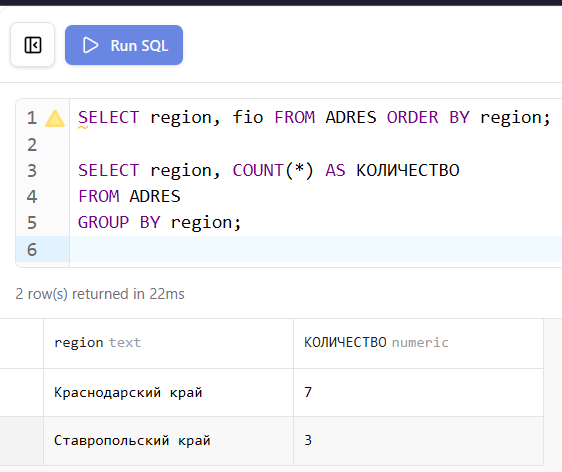{ width=80% }

## Задание 12. Вывести студентов проживающих в одном городе на одной улице

```sql
SELECT gorod, ulica, GROUP_CONCAT(fio ORDER BY fio SEPARATOR ', ') AS СТУДЕНТЫ,
       COUNT(*) AS КОЛИЧЕСТВО
FROM ADRES
GROUP BY gorod, ulica
HAVING COUNT(*) > 1;
```

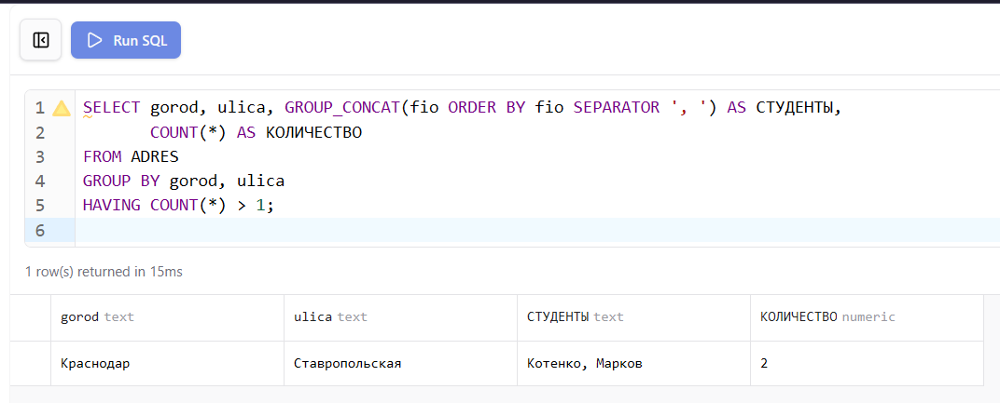{ width=110% }

# 4. Проверка результатов

После запуска базы данных командой `docker compose up -d` из папки `lab-11` все таблицы создаются и заполняются автоматически из общего файла `student-init.sql`. Корректность структуры и данных проверяется через Prisma Studio и phpMyAdmin.

Prisma Studio отображает все таблицы с данными и позволяет визуально проверить структуру базы и связи между ними.

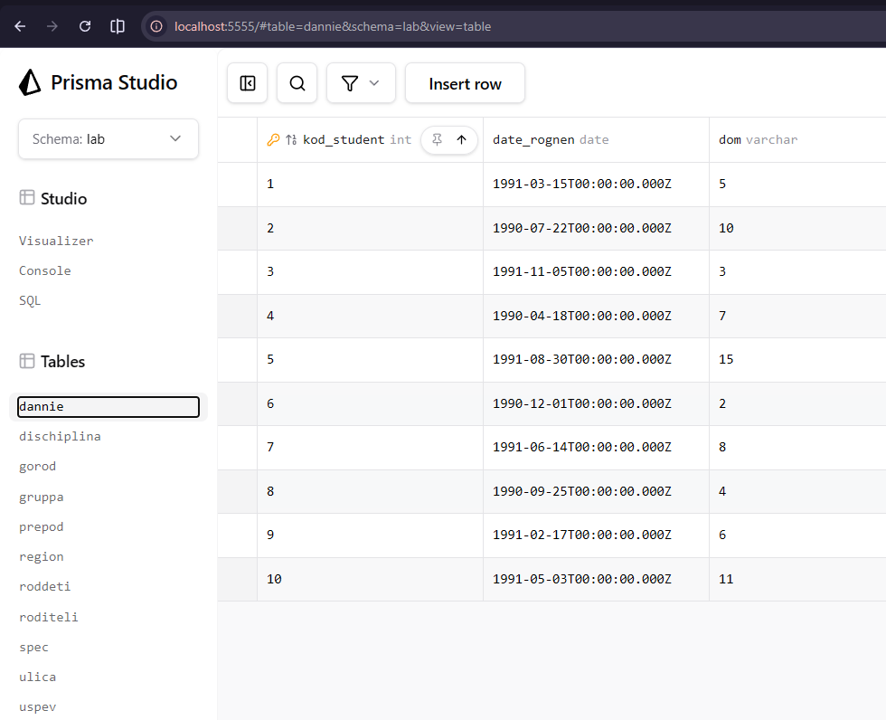{ width=80% }

phpMyAdmin предоставляет возможность выполнять SQL-запросы напрямую и просматривать результаты в табличном виде.

{ width=80% }

Диаграмма связей в Prisma Studio наглядно показывает отношения между всеми таблицами базы данных `student`.

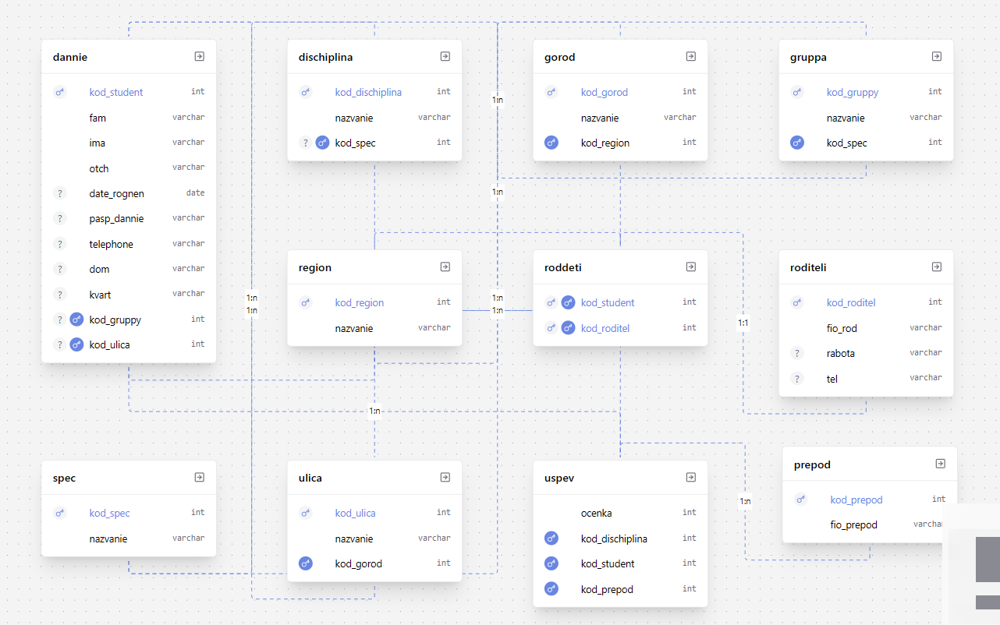{ width=80% }

## Вывод

В ходе лабораторной работы освоено создание и использование представлений в MySQL. Изучено применение оператора `CREATE VIEW` для определения виртуальных таблиц на основе сложных запросов с соединениями и агрегацией. Показано, что к представлениям можно обращаться точно так же, как к обычным таблицам — применять `WHERE`, `ORDER BY`, `GROUP BY` и агрегатные функции, что позволяет скрывать сложность исходных запросов и упрощать повторное использование часто применяемых выборок.
